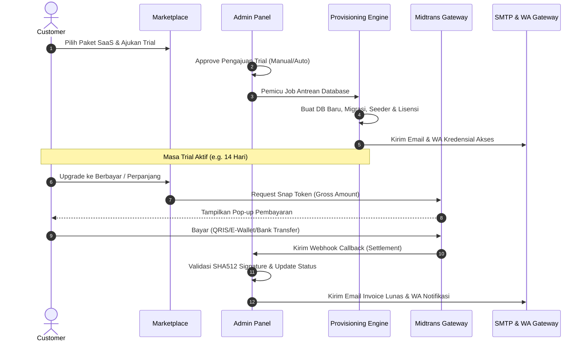
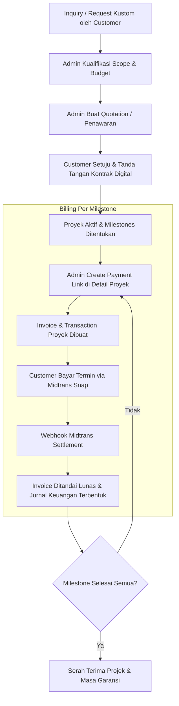

# COOCA.ID — Workflow Core Bisnis & Kustom

Dokumen ini menjelaskan alur kerja bisnis utama (*Core Business Workflows*) dan alur kerja kustom (*Custom Workflows*) yang berjalan pada platform enterprise **COOCA.ID**.

---

## 1. Alur Core Bisnis (SaaS & Subscription)

Alur core bisnis COOCA.ID berpusat pada penjualan produk Software-as-a-Service (SaaS) modular yang di-provisioning secara otomatis setelah pembayaran sukses lewat payment gateway Midtrans.

### Penjelasan Langkah Detail:

1. **Setup Catalog & Plan (Modul 3):**
   Admin menetapkan produk ERP, kategori, fitur, limitasi (max users, max domains), serta paket harga (bulanan/tahunan) di Admin Panel.
2. **Pengajuan Trial (Modul 4):**
   Customer mendaftar dan mengajukan uji coba (*Trial*). Pengajuan masuk ke antrean persetujuan admin (`trials` dan `trial_status_histories` tables).
3. **Auto-Provisioning (Modul 5):**
   Setelah disetujui, job dikirim ke antrean (`database` queue driver). System otomatis:
   - Membuat database baru secara aman (terisolasi untuk multi-tenancy).
   - Menjalankan file migrations & seeders untuk tenant.
   - Generate License Key dengan domain binding ([License.php](file:///c:/laragon/www/saas/cooca-id/app/Models/License.php)).
4. **Billing & Invoice (Modul 6 & 7):**
   Ketika masa trial habis atau user melakukan upgrade, sistem menerbitkan `Subscription` (status: `waiting_payment`) dan `Invoice` (status: `issued`).
5. **Payment Gateway Integration (Midtrans Snap):**
   Customer mengklik tombol bayar yang membuka pop-up Midtrans Snap. Begitu lunas, webhook callback dikirim ke `/webhook/midtrans/callback`.
6. **Auto-Journaling & Commission (Financial Engine):**
   Webhook otomatis:
   - Mengubah status Invoice menjadi `paid`.
   - Mengaktifkan lisensi subscription.
   - Menghitung komisi afiliasi jika customer datang dari referral.
   - Membuat jurnal akuntansi otomatis (*General Ledger*) melalui `AccountingService`.

---

## 2. Alur Kustom (Custom Workflows)

Alur kustom terbagi menjadi dua skenario utama: **Paket SaaS dengan Spesifikasi Kustom** dan **Pekerjaan Custom Development (Project-Based)**.

### Skenario A: SaaS dengan Spesifikasi Kustom
Digunakan jika customer menginginkan paket SaaS standar tetapi dengan parameter harga, jumlah user, atau modul yang dinegosiasikan khusus.
* **Proses Setup:** Admin membuat **Subscription Plan** kustom langsung melalui panel admin yang di-scope hanya untuk customer tersebut (atau menggunakan penawaran harga khusus).
* **Proses Pembayaran:** Proses penagihan dan auto-provisioning berjalan sama seperti alur core bisnis standar.

---

### Skenario B: Custom Development (Project-Based)
Digunakan untuk jasa pembuatan modul kustom, integrasi API khusus, atau pengerjaan proyek software kustom yang pembayarannya dicicil berdasarkan termin/milestone yang disepakati.

### Penjelasan Langkah Detail:

1. **CRM Leads & Deal Pipeline:**
   Customer mengirim permintaan kustomisasi awal (`ErpRequest`). Admin memindahkan request ini ke dalam CRM Pipeline ([Deal.php](file:///c:/laragon/www/saas/cooca-id/app/Models/Deal.php)) untuk mengawal negosiasi scope pekerjaan.
2. **Quotation & Kontrak:**
   Admin menerbitkan penawaran harga resmi (*Quotation*). Setelah customer sepakat, sistem membuat draf [Contract.php](file:///c:/laragon/www/saas/cooca-id/app/Models/Contract.php). Customer melakukan tanda tangan digital di portal untuk mengubah status kontrak menjadi `signed`.
3. **Generate Payment Link (Fitur Baru Admin):**
   Admin masuk ke halaman detail proyek kustom ([show.blade.php](file:///c:/laragon/www/saas/cooca-id/resources/views/admin/projects/show.blade.php)) dan dapat menginput nominal serta deskripsi termin (misal: *Down Payment 30%*).
   Sistem otomatis:
   - Membuat `Transaction` berkategori `project_payment` yang terhubung ke `project_id`.
   - Membuat `Invoice` terkait dengan status `issued`.
   - Mendaftarkan transaksi ke Midtrans untuk menghasilkan **Snap Token** & **Redirect URL**.
4. **Pembayaran Termin (Portal Customer):**
   Customer masuk ke menu Proyek di dashboard ([show.blade.php](file:///c:/laragon/www/saas/cooca-id/resources/views/customer/projects/show.blade.php)), melihat daftar tagihan termin yang aktif, lalu mengklik **Pay Now** untuk membuka overlay pembayaran Midtrans.
5. **Reconciliation & Progress:**
   Setiap termin yang lunas akan memperbarui status milestone pembayaran dan memicu pencatatan jurnal keuangan secara otomatis untuk melacak arus kas masuk projek kustom.
