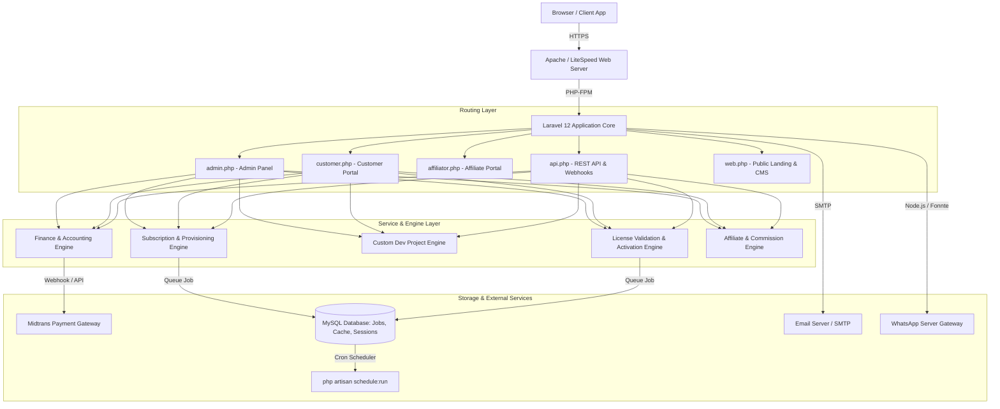
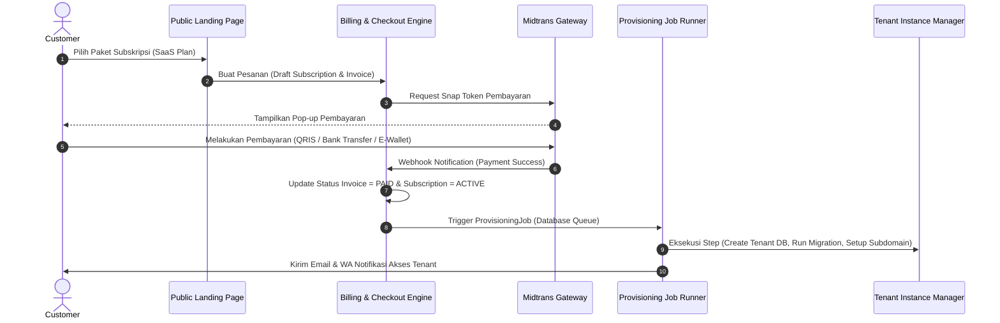
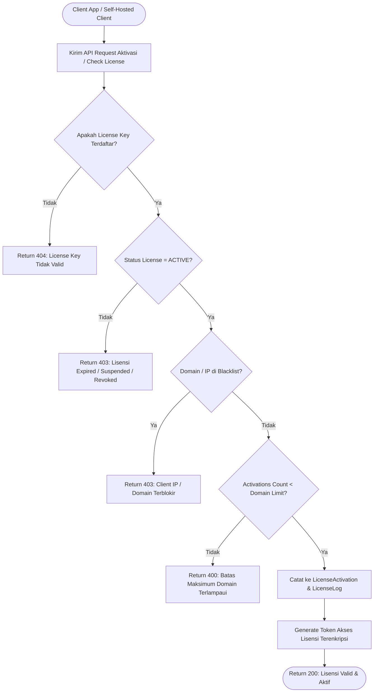
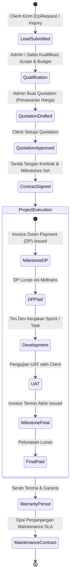

# Dokumentasi Teknis & Workflow System Enterprise COOCA.ID

**Versi Dokumentasi:** 1.0.0  
**Sistem:** `cooca-id` (Enterprise Single Business Management Platform)  
**Teknologi Utama:** Laravel 12, PHP 8.3+, MySQL 8, Livewire v4, Alpine.js, Tailwind CSS v4, Midtrans Payment Gateway, WhatsApp API.

---

## 1. Arsitektur Teknis Sistem (System Architecture)

### 1.1 Diagram Arsitektur Komponen



---

## 2. Diagram Workflow Utama (Core Business Workflows)

### 2.1 Workflow 1: Registrasi, Pembelian SaaS, & Auto Provisioning



---

### 2.2 Workflow 2: Validasi Lisensi Software (Domain & IP Binding)



---

### 2.3 Workflow 3: Custom Development Project Lifecycle



---

### 2.4 Workflow 4: Kalkulasi Komisi Afiliasi & Payout Engine

```mermaid
flowchart LR
    RefLink[Referral Link Klik oleh Lead] --> SaveCookie[Simpan Cookie Ref Code]
    SaveCookie --> UserRegister[User mendaftar Customer Account]
    UserRegister --> LinkAff[Relasikan Customer ID ke Affiliator ID]
    
    UserRegister --> UserPay[Customer Bayar Invoice SaaS / Product]
    UserPay --> CheckAffRule{Hitung Aturan Komisi}
    
    CheckAffRule --> CalcComm[Bagi Hasil: Total Paid * Commission Rate %]
    CalcComm --> CreateRecord[Buat Record AffiliateCommission - Status: PENDING]
    
    CreateRecord --> HoldingPeriod{Masa Holding Matang? e.g. 7 Hari}
    HoldingPeriod -- Ya --> CreditWallet[Pindahkan Status ke APPROVED & Tambah Saldo AffiliateWallet]
    
    CreditWallet --> RequestWD[Afiliator Minta Penarikan AffiliateWithdrawal]
    RequestWD --> AdminApprove[Admin Verifikasi & Process Payout]
    AdminApprove --> WDComplete[Saldo Didebit & Notifikasi Transfer Terkirim]
```



---

## 3. Spesifikasi Service Layer & Interface (Clean Architecture)

### 3.1 Interface Pengecekan Batas Kuota (Quota & Limit Enforcer)
Terletak pada layer pemrosesan batas penggunaan multi-tenant:

```php
namespace App\Shared\Contracts;

interface QuotaEnforcerInterface {
    /**
     * Memeriksa apakah tenant masih memiliki kuota untuk transaksi tertentu.
     */
    public function checkLimit(int $tenantId, string $metricName, int $requestedAmount = 1): bool;

    /**
     * Mencatat pemakaian kuota secara real-time.
     */
    public function recordUsage(int $tenantId, string $metricName, int $amountUsed = 1): void;
}
```

### 3.2 Service Auto-Reconciliation Keuangan
Mengubah setiap transaksi lunas menjadi jurnal akuntansi (*General Ledger*):

```php
namespace App\Services;

use App\Models\Invoice;
use App\Models\JournalEntry;
use App\Models\Payment;

class FinancialReconciliationService {
    public function reconcilePaidInvoice(Invoice $invoice, Payment $payment): JournalEntry
    {
        // 1. Buat Journal Entry Header
        $entry = JournalEntry::create([
            'entry_number' => 'JE-' . date('Ymd') . '-' . sprintf('%04d', $invoice->id),
            'date' => now(),
            'description' => 'Pembayaran Invoice #' . $invoice->invoice_number,
            'reference_type' => Invoice::class,
            'reference_id' => $invoice->id,
        ]);

        // 2. Debet: Kas / Bank (Sesuai Channel Midtrans / Manual)
        $entry->items()->create([
            'chart_of_account_id' => $payment->bank_account_id,
            'type' => 'debit',
            'amount' => $payment->amount,
        ]);

        // 3. Kredit: Pendapatan Produk / SaaS / Services
        $entry->items()->create([
            'chart_of_account_id' => $invoice->revenue_account_id,
            'type' => 'credit',
            'amount' => $invoice->subtotal,
        ]);

        return $entry;
    }
}
```

---

## 4. Matriks Aksesibilitas Role & Permisi (RBAC Matrix)

| Modul / Operasi | Super Admin | Customer / User | Affiliator | Public / Guest |
| :--- | :---: | :---: | :---: | :---: |
| **Catalog & Products** | Full Access (CRUD) | View Only | View Only | View Only |
| **Subskripsi & SaaS** | Manage All Tenants | Own Subscription | - | Request Trial |
| **License Management** | Issue / Revoke / Block | View Own Keys | - | API Verify Only |
| **Custom Projects** | Full CRM & Quotation | View Own Project & Pay | - | Submit Inquiry |
| **Affiliate Dashboard**| Approve Payouts | - | View Balance & WD | Register Ref |
| **Financial & Journal**| Full Ledger Access | View Own Invoices | - | - |
| **Helpdesk Tickets** | Reply / Close All | Create / Reply Own | - | - |

---

## 5. Panduan Pemeliharaan & Operasional (DevOps / Shared Hosting)

### 5.1 Perintah Operasional Rutin (Artisan Commands)

```bash
# 1. Bersihkan Seluruh Cache Aplikasi
php artisan optimize:clear

# 2. Re-cache Konfigurasi dan Routing (Wajib setelah update .env atau routes)
php artisan config:cache
php artisan route:cache
php artisan view:cache

# 3. Jalankan Pengujian Otomatis (Unit & Feature Tests)
php artisan test

# 4. Pengolahan Antrean Job (Driver Database di Shared Hosting)
php artisan queue:work --stop-when-empty --max-time=50 --tries=3
```

### 5.2 Konfigurasi Cron Job (cPanel / Shared Hosting)

Tambahkan perintah berikut pada cPanel Cron Jobs agar berjalan **setiap 1 menit**:

```bash
* * * * * cd /home/username/public_html && php artisan schedule:run >> /dev/null 2>&1
```

---

## 6. Penutup & Garis Besar Pengembangan
Dokumentasi teknis ini menjadi acuan integrasi antar-modul di COOCA.ID. Dengan pemisahan layer yang jelas, arsitektur database yang mencakup 70 model, serta dukungan antrean berbasis database, sistem dapat beroperasi secara handal di lingkungan *shared hosting* maupun berskala besar di VPS/Cloud.
