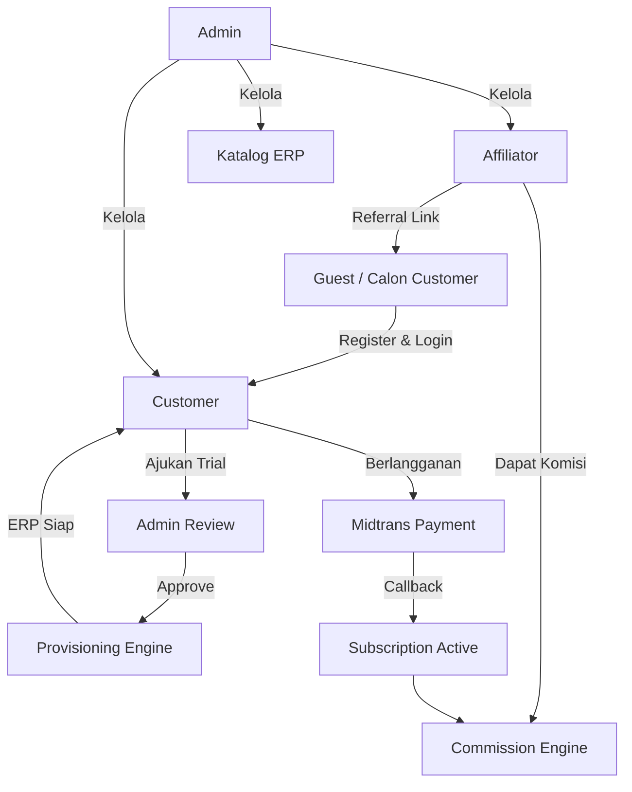
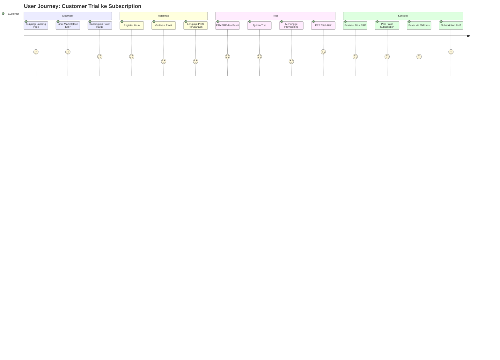

# COOCA.ID — Dokumentasi Strategis & Requirement
## Bagian 1: Executive Summary, Vision & Mission, Business Overview, Stakeholder Analysis, BRD, PRD

**Versi Dokumen:** 1.0
**Status:** Final Draft — Siap Implementasi
**Klasifikasi Infrastruktur:** Shared Hosting (Tanpa Redis, Tanpa Nginx, Tanpa Supervisor)
**Stack Utama:** Laravel 12, PHP 8.4, MySQL 8, Database Queue Driver, Cron Scheduler, Apache/LiteSpeed

> **Catatan Adaptasi Infrastruktur:** Seluruh dokumen dalam rangkaian ini disesuaikan dari spesifikasi awal yang mengasumsikan Redis dan Nginx. Karena COOCA.ID dioperasikan di atas **shared hosting**, seluruh mekanisme antrian (queue), caching, dan session menggunakan **driver database/file**, bukan Redis. Web server yang diasumsikan adalah **Apache dengan mod_php atau LiteSpeed** (umum tersedia di shared hosting cPanel), bukan Nginx. Proses background (queue worker, scheduler) dijalankan melalui **Cron Job** yang memanggil `php artisan schedule:run` setiap menit, tanpa Supervisor. **Seluruh notifikasi sistem ditambahkan dukungan Email SMTP** sebagai kanal wajib (selain WhatsApp/Fonnte yang bersifat opsional per tenant).

---

# 1. Executive Summary

## 1.1 Ringkasan Eksekutif

COOCA.ID adalah platform **SaaS ERP Marketplace Multi-Tenant** yang memungkinkan pelaku bisnis di Indonesia — khususnya UMKM dan perusahaan skala menengah — untuk memilih, mencoba, berlangganan, dan mengoperasikan berbagai jenis sistem ERP (Enterprise Resource Planning) melalui satu portal terpusat, tanpa perlu melakukan instalasi, konfigurasi server, atau manajemen infrastruktur secara mandiri.

Platform ini berperan sebagai **hub sentral** yang menghubungkan tiga pihak: (1) Customer yang membutuhkan solusi ERP, (2) Produk-produk ERP independen yang dihosting terpisah (misalnya ERP Bengkel/Otomotif, ERP Manufaktur, ERP Retail), dan (3) Affiliator yang memasarkan platform melalui program referral berjenjang.

Model bisnis COOCA.ID adalah **subscription-based recurring revenue** dengan tambahan pendapatan dari biaya provisioning, add-on modul, dan biaya domain kustom. Setiap ERP yang terdaftar di marketplace COOCA.ID di-provisioning secara otomatis (automated tenant provisioning) begitu customer menyelesaikan alur trial atau pembayaran.

## 1.2 Latar Belakang Masalah

Pelaku UMKM di Indonesia menghadapi tiga hambatan utama dalam adopsi ERP:

| Hambatan | Deskripsi | Solusi COOCA.ID |
|---|---|---|
| Biaya Awal Tinggi | Implementasi ERP konvensional membutuhkan investasi infrastruktur dan konsultan | Model subscription bulanan/tahunan tanpa investasi infrastruktur |
| Kompleksitas Teknis | UMKM tidak memiliki tim IT untuk deploy dan maintain server | Provisioning otomatis, tenant siap pakai dalam hitungan menit |
| Ketidakpastian Kecocokan Produk | Sulit menilai kecocokan ERP sebelum membeli | Mekanisme trial gratis dengan masa aktif terbatas |

## 1.3 Solusi yang Ditawarkan

COOCA.ID menyediakan:

1. **Marketplace ERP** — katalog produk ERP yang dapat difilter berdasarkan kategori bisnis, fitur, dan harga.
2. **Self-Service Trial & Subscription** — customer dapat mengajukan trial dan berlangganan tanpa intervensi manual dari tim sales.
3. **Automated Provisioning Engine** — pembuatan database, migrasi, seeder, domain, dan lisensi dilakukan otomatis oleh sistem.
4. **Affiliate Program** — mekanisme insentif dua level dengan komisi rekuren untuk mempercepat akuisisi pelanggan.
5. **Unified Billing & License Management** — satu sistem penagihan dan lisensi untuk seluruh produk ERP yang berjalan di atas platform.

## 1.4 Model Operasional Infrastruktur

Karena keterbatasan shared hosting, arsitektur operasional COOCA.ID dirancang dengan prinsip **"Zero Privileged Infrastructure Access"**:

- Tidak ada akses root/SSH tingkat sistem untuk mengelola Supervisor atau Redis.
- Seluruh proses asinkron (pengiriman email, provisioning, kalkulasi komisi) berjalan melalui **Laravel Queue dengan driver `database`**, dieksekusi oleh Cron Job yang memanggil `php artisan queue:work --stop-when-empty` setiap menit.
- Cache aplikasi menggunakan driver `database` atau `file`, bukan Redis.
- Session menggunakan driver `database` agar dapat diaudit (login history) dan konsisten antar proses PHP-FPM/CGI di shared hosting.

## 1.5 Target Pasar

- UMKM sektor jasa dan retail (skala 1–5 outlet)
- Perusahaan skala menengah yang membutuhkan multi-modul ERP (akuntansi, HRM, inventori)
- Digital agency/reseller yang ingin menjadi affiliator dan menjual ulang ERP ke jaringan klien mereka

## 1.6 Value Proposition Ringkas

> "Satu Platform, Semua ERP — Coba Gratis, Aktif dalam Hitungan Menit."

---

# 2. Vision & Mission

## 2.1 Visi

Menjadi platform SaaS ERP Marketplace nomor satu di Indonesia yang mendemokratisasi akses teknologi ERP enterprise-grade bagi seluruh pelaku usaha, dari UMKM hingga perusahaan menengah, tanpa hambatan biaya infrastruktur dan kompleksitas teknis.

## 2.2 Misi

1. Menyediakan proses onboarding ERP yang sepenuhnya otomatis dan dapat diselesaikan tanpa bantuan tim teknis.
2. Membangun ekosistem affiliate yang memberi insentif berkelanjutan bagi mitra pemasaran.
3. Menjamin keandalan operasional (uptime, keamanan data tenant) setara standar enterprise meskipun beroperasi di atas infrastruktur shared hosting yang efisien biaya.
4. Menyediakan transparansi penuh kepada customer atas status trial, tagihan, dan lisensi melalui dashboard real-time.
5. Memperluas katalog ERP secara berkelanjutan melalui kemitraan dengan pengembang ERP independen.

## 2.3 Nilai Inti (Core Values)

| Nilai | Penjelasan |
|---|---|
| Otomatisasi Penuh | Setiap proses bisnis inti (provisioning, billing, komisi) berjalan tanpa intervensi manual administrator |
| Transparansi | Customer dan affiliator memiliki visibilitas penuh atas status transaksi mereka |
| Keamanan Data | Isolasi data antar tenant dijaga ketat meskipun berbagi infrastruktur fisik |
| Efisiensi Biaya | Arsitektur dirancang agar dapat beroperasi profitabel di atas biaya hosting minimal |

---

# 3. Business Overview

## 3.1 Model Bisnis

COOCA.ID beroperasi dengan model **Platform-as-a-Marketplace**, di mana COOCA.ID tidak hanya menjual satu produk ERP, melainkan menjadi perantara distribusi bagi banyak produk ERP yang secara teknis dihosting terpisah (independent hosting per produk ERP), namun dikelola secara terpusat dari sisi subscription, billing, license, dan affiliate melalui COOCA.ID.

## 3.2 Aktor Bisnis

## 3.3 Sumber Pendapatan

| Sumber | Deskripsi | Model |
|---|---|---|
| Subscription Fee | Biaya berlangganan bulanan/tahunan per ERP per tenant | Recurring |
| Setup/Provisioning Fee | Biaya satu kali untuk provisioning awal (opsional per produk ERP) | One-time |
| Custom Domain Fee | Biaya tambahan penggunaan domain kustom milik customer | Recurring/One-time |
| Add-on Module Fee | Biaya modul tambahan di luar paket dasar | Recurring |
| Marketplace Commission | Potensi komisi dari pengembang ERP pihak ketiga yang terdaftar di marketplace | Revenue Share |

## 3.4 Struktur Biaya Operasional Utama

- Biaya hosting shared per instance ERP (ditanggung provisioning cost)
- Biaya payment gateway (Midtrans transaction fee)
- Biaya notifikasi (SMTP provider, WhatsApp API/Fonnte)
- Biaya komisi affiliate (25% Level 1, 5% Level 2, recurring)

## 3.5 Ruang Lingkup Bisnis

**Termasuk dalam ruang lingkup:**
- Manajemen katalog dan marketplace ERP
- Manajemen trial dan subscription
- Payment processing melalui Midtrans
- Provisioning otomatis tenant ERP
- Program affiliate dua level dengan recurring commission
- Sistem notifikasi Email SMTP dan WhatsApp
- CMS untuk landing page, blog, dan dokumentasi publik
- Sistem ticketing untuk dukungan pelanggan

**Tidak termasuk dalam ruang lingkup (out of scope):**
- Pengembangan fitur internal masing-masing produk ERP (dikelola terpisah oleh tim produk ERP masing-masing)
- Layanan konsultasi implementasi on-site
- Integrasi payment gateway selain Midtrans pada fase awal

---

# 4. Stakeholder Analysis

## 4.1 Matriks Stakeholder

| Stakeholder | Kepentingan | Pengaruh | Ekspektasi Utama |
|---|---|---|---|
| Founder/Owner Platform | Sangat Tinggi | Sangat Tinggi | Profitabilitas, skalabilitas, brand trust |
| Customer (Tenant) | Tinggi | Sedang | Proses onboarding cepat, ERP stabil, billing transparan |
| Affiliator | Tinggi | Sedang | Tracking komisi akurat, pencairan tepat waktu |
| Admin Operasional | Sedang | Tinggi | Tools manajemen yang lengkap dan efisien |
| Tim Pengembang ERP Mitra | Sedang | Sedang | Integrasi provisioning yang jelas dan stabil |
| Payment Gateway (Midtrans) | Rendah | Tinggi (regulatif) | Kepatuhan terhadap standar callback dan keamanan |
| Penyedia Shared Hosting | Rendah | Sedang | Kepatuhan terhadap batas resource (CPU, proses, cron) |
| Calon Investor | Sedang | Tinggi | Metrik pertumbuhan MRR, churn rate, CAC |

## 4.2 RACI — Proses Kunci

| Proses | Responsible | Accountable | Consulted | Informed |
|---|---|---|---|---|
| Approval Trial | Admin Operasional | Admin Manager | Customer Support | Customer |
| Provisioning ERP | Sistem (Automated) | Tech Lead | DevOps | Customer, Admin |
| Payment Callback | Sistem (Automated) | Finance Admin | Midtrans | Customer |
| Pencairan Komisi Affiliate | Finance Admin | Admin Manager | Affiliator | Affiliator |
| Publikasi Blog/CMS | Content Admin | Marketing Lead | - | Guest |

---

# 5. Business Requirement Document (BRD)

## 5.1 Business Goals

1. Mencapai proses onboarding customer dari registrasi hingga ERP aktif dalam waktu **kurang dari 15 menit** (untuk trial dengan provisioning otomatis penuh).
2. Menekan tingkat churn subscription di bawah **5% per bulan** pada tahun pertama operasi.
3. Mencapai minimal **500 tenant aktif** dalam 12 bulan pertama sejak Go-Live.
4. Membangun jaringan affiliate dengan minimal **100 affiliator aktif** yang menghasilkan referral dalam 6 bulan pertama.
5. Menjaga uptime platform dan seluruh tenant ERP di atas **99.5%** meskipun berbasis shared hosting.

## 5.2 Business Scope

Sebagaimana dijelaskan pada Bagian 3.5 (Ruang Lingkup Bisnis).

## 5.3 Business Process (Ringkasan)

Lihat diagram alur pelanggan pada Bagian 3.2 dan detail lengkap pada dokumen FSD (Bagian 7 rangkaian dokumen ini).

## 5.4 Stakeholders

Lihat Bagian 4.

## 5.5 Business Rules

| Kode | Business Rule |
|---|---|
| BR-01 | Satu akun customer dapat memiliki lebih dari satu tenant ERP aktif secara bersamaan, masing-masing dengan subscription terpisah. |
| BR-02 | Trial hanya dapat diajukan satu kali per kombinasi (customer, produk ERP). Trial kedua untuk produk ERP yang sama memerlukan approval manual khusus dari Admin. |
| BR-03 | Masa trial default adalah 14 hari kalender, dapat dikonfigurasi per produk ERP oleh Admin. |
| BR-04 | Trial yang tidak dikonversi menjadi subscription akan otomatis berstatus `Expired` dan database tenant akan di-nonaktifkan (bukan dihapus) setelah masa retensi 30 hari. |
| BR-05 | Subscription tidak dapat diaktifkan sebelum status pembayaran invoice terkait berstatus `Paid`, divalidasi melalui signature callback Midtrans. |
| BR-06 | Kode affiliate hanya berlaku pada saat registrasi awal customer; tidak dapat ditambahkan/diubah setelah akun dibuat. |
| BR-07 | Komisi affiliate Level 1 (25%) diberikan kepada affiliator yang mereferensikan customer secara langsung; Komisi Level 2 (5%) diberikan kepada affiliator upline dari affiliator Level 1. |
| BR-08 | Recurring commission dihitung ulang pada setiap siklus pembayaran subscription selama subscription tetap aktif. |
| BR-09 | Domain subdomain (`*.cooca.id`) disediakan gratis untuk setiap tenant; custom domain memerlukan verifikasi DNS dan dikenakan biaya tambahan. |
| BR-10 | License Key digenerate ulang (rotasi) apabila terjadi indikasi pelanggaran (misalnya penggunaan di luar domain terdaftar), dan API Token lama otomatis di-revoke. |
| BR-11 | Seluruh notifikasi transaksional (trial, pembayaran, provisioning, komisi) WAJIB dikirim melalui Email SMTP; pengiriman WhatsApp bersifat tambahan (opsional) dan tidak menggantikan email. |
| BR-12 | Proses provisioning yang gagal pada tahap manapun akan melakukan rollback otomatis (drop database, hapus subdomain) dan mengirim notifikasi kegagalan ke Admin serta Customer. |

## 5.6 Success Metrics & KPIs

| Metrik | Target | Frekuensi Pengukuran |
|---|---|---|
| Trial-to-Paid Conversion Rate | ≥ 25% | Bulanan |
| Average Provisioning Time | < 5 menit | Per transaksi |
| Monthly Recurring Revenue (MRR) Growth | ≥ 15% MoM (6 bulan pertama) | Bulanan |
| Customer Churn Rate | < 5% | Bulanan |
| Affiliate Payout Accuracy | 100% (zero discrepancy) | Per siklus pencairan |
| Platform Uptime | ≥ 99.5% | Bulanan |
| Ticket Resolution Time (SLA) | < 24 jam (Priority Normal) | Per ticket |

## 5.7 Constraints

- Infrastruktur terbatas pada **shared hosting** — tidak ada Redis, tidak ada akses Supervisor/systemd, tidak ada Nginx (menggunakan Apache/LiteSpeed bawaan hosting).
- Proses background bergantung pada **Cron Job** dengan interval minimum 1 menit (batasan umum shared hosting cPanel).
- Kapasitas concurrent proses PHP terbatas sesuai paket hosting (umumnya dibatasi jumlah proses simultan oleh provider).
- Payment gateway terbatas pada Midtrans di fase awal.

## 5.8 Risks

| Risiko | Dampak | Mitigasi |
|---|---|---|
| Keterbatasan resource shared hosting saat lonjakan tenant baru | Tinggi | Queue database dengan batching, rate limiting provisioning per menit |
| Cron job terlewat/delay oleh provider hosting | Sedang | Idempotent job design, monitoring scheduler via heartbeat log |
| Kegagalan callback Midtrans (network) | Sedang | Retry mechanism, manual reconciliation tool di Admin Panel |
| Penyalahgunaan sistem affiliate (fraud referral) | Tinggi | Validasi IP/device fingerprint, review manual untuk komisi di atas threshold |
| Kebocoran data antar tenant | Sangat Tinggi | Isolasi database per tenant, enkripsi kredensial, audit trail ketat |

## 5.9 Assumptions

- Setiap produk ERP mitra menyediakan API provisioning standar (endpoint migrasi, seeder) yang kompatibel dengan orkestrator COOCA.ID.
- Penyedia shared hosting mendukung minimal PHP 8.4, MySQL 8, dan cron job per menit.
- Customer memiliki akses email aktif sebagai kanal komunikasi utama.

## 5.10 Dependencies

- Midtrans Payment Gateway (Snap API + Callback/Notification API)
- SMTP Provider (misalnya untuk pengiriman email transaksional)
- Fonnte WhatsApp API (opsional, notifikasi tambahan)
- Google OAuth API (login sosial)
- DNS Provider untuk verifikasi custom domain

---

# 6. Product Requirement Document (PRD)

## 6.1 Product Vision

COOCA.ID adalah "App Store untuk ERP" — sebuah portal tunggal di mana pelaku usaha dapat menemukan, mencoba, dan mengaktifkan sistem ERP yang sesuai kebutuhan bisnis mereka secepat mereka berlangganan aplikasi SaaS pada umumnya.

## 6.2 Product Objectives

1. Menyediakan pengalaman self-service penuh dari discovery hingga aktivasi ERP.
2. Meminimalkan friction pembayaran melalui integrasi Midtrans Snap.
3. Memberikan visibilitas penuh kepada customer atas siklus hidup trial dan subscription mereka.
4. Menyediakan tooling affiliate yang kompetitif dibanding platform SaaS sejenis.

## 6.3 User Personas

### Persona 1 — "Budi", Pemilik UMKM Bengkel
- Usia 35–45, pemilik 1–2 outlet bengkel otomotif.
- Kebutuhan: sistem pencatatan servis dan keuangan yang mudah, tanpa perlu tim IT.
- Pain point: takut proses setup ERP rumit dan mahal.
- Goal di platform: mencoba ERP gratis, lihat kecocokan, lalu berlangganan bulanan dengan harga terjangkau.

### Persona 2 — "Sari", Digital Marketing Freelancer (Calon Affiliator)
- Usia 25–35, mengelola beberapa klien UMKM.
- Kebutuhan: sumber penghasilan tambahan melalui referral produk digital.
- Goal di platform: mendaftar sebagai affiliator, membagikan link referral ke jaringan klien, memantau komisi secara real-time.

### Persona 3 — "Pak Hendra", Admin Operasional COOCA.ID
- Bertanggung jawab memverifikasi trial, memantau provisioning, dan menangani tiket dukungan.
- Goal di platform: dashboard yang menampilkan antrian approval, status provisioning, dan log kegagalan secara jelas.

## 6.4 User Journey (Customer — Trial ke Subscription)

## 6.5 Feature List (Ringkasan per Panel)

| Panel | Fitur Utama |
|---|---|
| Guest Panel | Landing Page, ERP Marketplace, Pricing, Blog, Register/Login, Google OAuth |
| Customer Panel | Dashboard, Trial Management, Subscription, Invoice, Domain, License, API Token, Ticket |
| Affiliator Panel | Dashboard, Referral Link/QR, Commission, Withdrawal, Marketing Kit |
| Admin Panel | Manajemen seluruh entitas, Provisioning Monitoring, System Log, Settings |

Detail fungsional lengkap tiap fitur dijabarkan dalam **FSD (Bagian 7)**.

## 6.6 Functional Requirements (Ringkasan Level Produk)

| ID | Requirement |
|---|---|
| FR-01 | Sistem harus mendukung registrasi melalui Email/Password dan Google OAuth. |
| FR-02 | Sistem harus mengirimkan email verifikasi sebelum customer dapat mengajukan trial. |
| FR-03 | Sistem harus menyediakan katalog ERP dengan filter kategori, harga, dan fitur. |
| FR-04 | Sistem harus mendukung pengajuan trial dengan validasi kuota trial per customer. |
| FR-05 | Sistem harus melakukan provisioning otomatis (database, migration, seeder, domain, SSL, license, API token) setelah approval. |
| FR-06 | Sistem harus terintegrasi dengan Midtrans Snap untuk pembayaran subscription. |
| FR-07 | Sistem harus menghitung dan mencatat komisi affiliate dua level secara otomatis pada setiap pembayaran berhasil. |
| FR-08 | Sistem harus mengirimkan notifikasi Email SMTP untuk setiap perubahan status trial, subscription, invoice, dan komisi. |
| FR-09 | Sistem harus mencatat audit trail untuk seluruh aksi administratif dan transaksi finansial. |
| FR-10 | Sistem harus menyediakan sistem ticketing untuk dukungan pelanggan dengan SLA tracking. |

## 6.7 Non Functional Requirements (Ringkasan Level Produk)

Dijabarkan lengkap dalam SRS (Bagian 8). Ringkasan:
- Ketersediaan sistem ≥ 99.5% dalam batasan shared hosting.
- Waktu respons API ≤ 500ms untuk 95 persentil (P95) pada operasi baca standar.
- Keamanan data mengikuti prinsip least privilege dan enkripsi data sensitif saat disimpan (at-rest) dan saat transit (TLS).

## 6.8 Acceptance Criteria (Contoh — Modul Trial)

- **Given** customer telah memverifikasi email dan melengkapi profil perusahaan, **When** customer mengajukan trial untuk produk ERP tertentu yang belum pernah di-trial, **Then** sistem membuat record trial berstatus `Submitted` dan mengirim notifikasi email konfirmasi.
- **Given** trial disetujui oleh Admin, **When** proses provisioning berjalan otomatis, **Then** dalam waktu maksimal 5 menit tenant ERP berstatus `ActiveTrial` dan customer menerima email berisi URL akses, license key, dan kredensial awal.
- **Given** trial mencapai tanggal kedaluwarsa tanpa konversi ke subscription, **When** scheduler harian berjalan, **Then** status trial berubah menjadi `Expired` dan email notifikasi kedaluwarsa dikirim ke customer.

## 6.9 Success Metrics (Level Produk)

Sama seperti KPI pada Bagian 5.6, dengan tambahan metrik produk:
- Time-to-First-Value (waktu dari registrasi hingga trial aktif) ≤ 15 menit.
- Feature Adoption Rate modul add-on ≥ 20% dari total tenant aktif.

## 6.10 Roadmap

| Fase | Cakupan | Estimasi |
|---|---|---|
| Fase 1 — MVP | Guest Panel, Customer Panel (trial & subscription dasar), Provisioning Engine, Payment Midtrans, Notifikasi Email SMTP | Bulan 1–3 |
| Fase 2 — Affiliate & CMS | Affiliator Panel penuh, CMS (Blog, FAQ, Documentation), Coupon/Promotion | Bulan 4–5 |
| Fase 3 — Operational Hardening | Admin Panel lengkap, Monitoring, Ticketing, Audit Trail penuh, Security Hardening | Bulan 6–7 |
| Fase 4 — Scale & Optimize | Custom Domain otomatisasi penuh, Reporting lanjutan, Optimasi performa shared hosting | Bulan 8+ |

## 6.11 Release Plan

- **Release 1.0 (Go-Live MVP):** Guest + Customer Panel dasar, satu produk ERP terintegrasi sebagai pilot (Bagema ERP), Midtrans, Email SMTP.
- **Release 1.1:** Affiliate Program penuh dengan recurring commission.
- **Release 1.2:** Admin Panel penuh, Ticketing, Monitoring.
- **Release 2.0:** Multi-ERP marketplace dengan onboarding mitra ERP baru secara self-service.

---

*Lanjut ke Bagian 2: Functional Specification Document (FSD) pada file `02-functional-spec-fsd.md`.*
