# COOCA.ID — Functional Specification Document (FSD)
## Bagian 2 dari Rangkaian Dokumentasi

Setiap modul dijelaskan dengan struktur: Objective, Description, Workflow, Business Rules, Validation Rules, CRUD Specification, State Machine, UI Behaviour, API Behaviour, Error Handling, Notification, Permission Matrix, Activity Log, Audit Trail.

Seluruh notifikasi pada setiap modul WAJIB memiliki kanal **Email SMTP** sebagai default, dengan WhatsApp (Fonnte) sebagai kanal tambahan opsional.

---

# Modul 1: Authentication & Registration

## 1.1 Objective
Menyediakan mekanisme registrasi dan otentikasi yang aman bagi Customer dan Affiliator, mendukung Email/Password dan Google OAuth.

## 1.2 Description
Modul ini menangani seluruh siklus identitas pengguna: registrasi, verifikasi email, login, forgot password, reset password, dan pengelolaan sesi. Menggunakan Laravel Sanctum untuk API token dan multi-guard untuk memisahkan konteks Customer, Affiliator, dan Admin.

## 1.3 Workflow

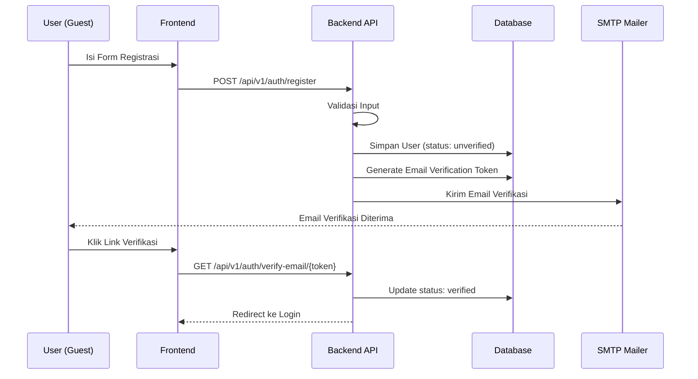
```mermaid
sequenceDiagram
    participant U as User (Guest)
    participant FE as Frontend
    participant API as Backend API
    participant DB as Database
    participant Mail as SMTP Mailer

    U->>FE: Isi Form Registrasi
    FE->>API: POST /api/v1/auth/register
    API->>API: Validasi Input
    API->>DB: Simpan User (status: unverified)
    API->>DB: Generate Email Verification Token
    API->>Mail: Kirim Email Verifikasi
    Mail-->>U: Email Verifikasi Diterima
    U->>FE: Klik Link Verifikasi
    FE->>API: GET /api/v1/auth/verify-email/{token}
    API->>DB: Update status: verified
    API-->>FE: Redirect ke Login
```

## 1.4 Business Rules
- BR-AUTH-01: Email harus unik di seluruh sistem (case-insensitive).
- BR-AUTH-02: Password minimal 8 karakter, mengandung huruf besar, huruf kecil, dan angka.
- BR-AUTH-03: Token verifikasi email berlaku 24 jam; setelah kedaluwarsa, user dapat meminta kirim ulang.
- BR-AUTH-04: Login melalui Google OAuth otomatis membuat akun dengan status `verified` (email dianggap tervalidasi oleh Google).
- BR-AUTH-05: Akun yang belum verifikasi tidak dapat mengajukan trial atau subscription, namun dapat mengakses dashboard dalam mode terbatas.
- BR-AUTH-06: Maksimal 5 kali percobaan login gagal dalam 15 menit akan mengunci akun sementara selama 30 menit (rate limiting berbasis IP + email).

## 1.5 Validation Rules

| Field | Aturan |
|---|---|
| name | required, string, max:255 |
| email | required, email format, unique:users, max:255 |
| password | required, min:8, mixed case, numeric, confirmed |
| phone | required, format nomor Indonesia (+62), unique |

## 1.6 CRUD Specification

| Aksi | Entitas | Guard | Deskripsi |
|---|---|---|---|
| Create | User | Guest | Registrasi baru |
| Read | User | Self/Admin | Lihat profil sendiri atau Admin melihat semua |
| Update | User | Self/Admin | Update profil, ganti password |
| Delete | User | Admin | Soft delete akun (bukan hard delete, demi audit trail) |

## 1.7 State Machine (Status Akun)

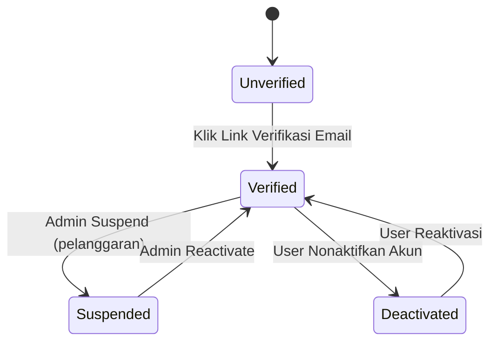
```mermaid
stateDiagram-v2
    [*] --> Unverified
    Unverified --> Verified: Klik Link Verifikasi Email
    Verified --> Suspended: Admin Suspend (pelanggaran)
    Suspended --> Verified: Admin Reactivate
    Verified --> Deactivated: User Nonaktifkan Akun
    Deactivated --> Verified: User Reaktivasi
```

## 1.8 UI Behaviour
- Form registrasi menampilkan validasi real-time (inline error) untuk setiap field.
- Setelah submit sukses, tampilkan halaman "Cek Email Anda" dengan opsi "Kirim Ulang Email Verifikasi" (cooldown 60 detik antar permintaan).
- Login dengan Google menampilkan tombol OAuth standar dengan branding Google Sign-In.

## 1.9 API Behaviour

| Endpoint | Method | Auth |
|---|---|---|
| /api/v1/auth/register | POST | Public |
| /api/v1/auth/login | POST | Public |
| /api/v1/auth/google/redirect | GET | Public |
| /api/v1/auth/google/callback | GET | Public |
| /api/v1/auth/verify-email/{token} | GET | Public (token-based) |
| /api/v1/auth/resend-verification | POST | Sanctum |
| /api/v1/auth/forgot-password | POST | Public |
| /api/v1/auth/reset-password | POST | Public (token-based) |
| /api/v1/auth/logout | POST | Sanctum |

## 1.10 Error Handling

| Kode | Kondisi | HTTP Status |
|---|---|---|
| AUTH_EMAIL_EXISTS | Email sudah terdaftar | 422 |
| AUTH_INVALID_CREDENTIALS | Email/password salah | 401 |
| AUTH_ACCOUNT_LOCKED | Akun terkunci sementara akibat rate limit | 429 |
| AUTH_TOKEN_EXPIRED | Token verifikasi/reset kedaluwarsa | 410 |
| AUTH_EMAIL_NOT_VERIFIED | Akses fitur yang mensyaratkan verifikasi | 403 |

## 1.11 Notification

| Event | Kanal | Template |
|---|---|---|
| Registrasi Berhasil | Email SMTP (wajib) | `email.auth.verify` |
| Verifikasi Berhasil | Email SMTP (wajib) | `email.auth.welcome` |
| Permintaan Reset Password | Email SMTP (wajib) | `email.auth.reset-password` |
| Login dari Perangkat Baru | Email SMTP (wajib) + WhatsApp (opsional) | `email.auth.new-device` |

## 1.12 Permission Matrix

| Role | Register | Login | Reset Password | Kelola User Lain |
|---|---|---|---|---|
| Guest | ✔ | ✔ | ✔ | ✘ |
| Customer | ✘ | ✔ | ✔ | ✘ (hanya profil sendiri) |
| Affiliator | ✘ | ✔ | ✔ | ✘ |
| Admin | ✘ | ✔ | ✔ | ✔ |

## 1.13 Activity Log
Setiap login, logout, perubahan password, dan aktivasi Google OAuth dicatat pada tabel `login_histories` dengan kolom: `user_id (uuid)`, `ip_address`, `user_agent`, `login_at`, `logout_at`, `status`.

## 1.14 Audit Trail
Perubahan status akun (Suspended/Deactivated) dicatat pada tabel `audit_trails` dengan `actor_id`, `action`, `old_value`, `new_value`, `created_at`.

---

# Modul 2: Company & Business Profile

## 2.1 Objective
Melengkapi data legal dan operasional customer yang menjadi prasyarat sebelum pengajuan trial.

## 2.2 Description
Menyimpan data perusahaan (nama badan usaha, NPWP opsional, alamat, jenis usaha) yang digunakan untuk keperluan invoice, provisioning nama tenant, dan segmentasi analitik.

## 2.3 Workflow
Customer login → Dashboard menampilkan banner "Lengkapi Profil Perusahaan" jika belum lengkap → Customer mengisi form profil → Sistem validasi → Profil tersimpan → Banner hilang, tombol "Ajukan Trial" menjadi aktif.

## 2.4 Business Rules
- BR-PROF-01: Profil perusahaan wajib lengkap (nama usaha, jenis usaha, alamat) sebelum customer dapat mengajukan trial.
- BR-PROF-02: Satu akun customer hanya memiliki satu company profile utama, namun dapat menambahkan multiple business profile (untuk multi-brand/multi-outlet) yang masing-masing dapat dikaitkan ke tenant ERP berbeda.

## 2.5 Validation Rules

| Field | Aturan |
|---|---|
| company_name | required, string, max:255 |
| business_type | required, in:enum predefined |
| address | required, string, max:500 |
| npwp | nullable, format 15/16 digit |
| phone | required, format Indonesia |

## 2.6 CRUD Specification
Standard CRUD dengan scoping `customer_id` — Customer hanya dapat mengelola profil miliknya sendiri; Admin dapat melihat seluruh profil untuk keperluan verifikasi.

## 2.7 State Machine
Tidak memiliki status kompleks — hanya `Incomplete` → `Complete`.

## 2.8 UI Behaviour
Form multi-step (Step 1: Data Perusahaan, Step 2: Alamat, Step 3: Jenis Usaha) dengan progress indicator dan auto-save draft ke local state sebelum submit final.

## 2.9 API Behaviour

| Endpoint | Method |
|---|---|
| /api/v1/customer/company-profile | GET, POST, PUT |
| /api/v1/customer/business-profiles | GET, POST, PUT, DELETE |

## 2.10 Error Handling
Validasi standar 422 dengan pesan per-field dalam Bahasa Indonesia.

## 2.11 Notification
Email SMTP konfirmasi setiap kali profil berhasil diperbarui (`email.profile.updated`).

## 2.12 Permission Matrix
Customer: CRUD profil sendiri. Admin: Read semua, Update untuk keperluan verifikasi manual.

## 2.13 Activity Log & Audit Trail
Setiap perubahan field profil dicatat di `audit_trails` dengan snapshot before/after dalam format JSON.

---

# Modul 3: ERP Marketplace & Catalog

## 3.1 Objective
Menyediakan katalog produk ERP yang dapat dijelajahi, dibandingkan, dan dipilih oleh calon customer.

## 3.2 Description
Berisi struktur ERP Category, ERP Product, ERP Module, ERP Version, ERP Feature, dan Subscription Plan yang terkait. Dikelola sepenuhnya oleh Admin Panel.

## 3.3 Workflow
Admin membuat ERP Product → menambahkan Category, Module, Feature, Version → menetapkan Subscription Plan (harga, kuota, fitur per tier) → produk dipublikasikan → tampil di Guest Panel Marketplace.

## 3.4 Business Rules
- BR-CAT-01: ERP Product hanya tampil di marketplace publik jika berstatus `Published` dan memiliki minimal satu Subscription Plan aktif.
- BR-CAT-02: Setiap ERP Product memiliki konfigurasi provisioning tersendiri (endpoint migrasi, seeder default, resource requirement) yang disimpan sebagai metadata JSON.
- BR-CAT-03: Perubahan harga Subscription Plan tidak memengaruhi subscription yang sudah berjalan (grandfathering) kecuali dinyatakan lain oleh Admin secara eksplisit per-tenant.

## 3.5 Validation Rules
| Field | Aturan |
|---|---|
| product_name | required, unique, max:255 |
| slug | required, unique, lowercase, alphanumeric-dash |
| category_id | required, exists:erp_categories |
| provisioning_config | required, valid JSON schema |

## 3.6 CRUD Specification
Full CRUD oleh Admin untuk seluruh entitas (Category, Product, Module, Version, Feature, Plan). Read-only publik untuk Guest/Customer melalui endpoint marketplace.

## 3.7 State Machine (ERP Product)
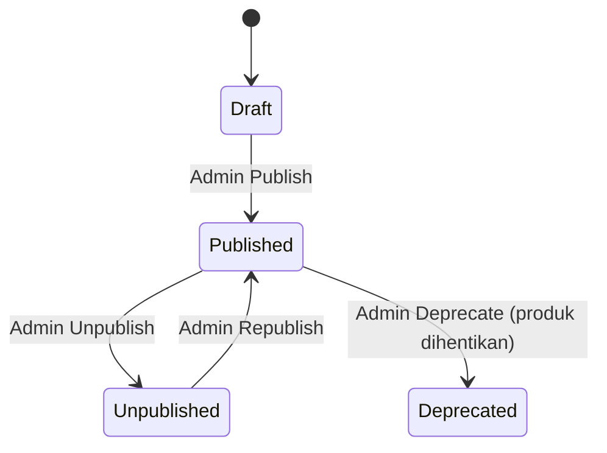
```mermaid
stateDiagram-v2
    [*] --> Draft
    Draft --> Published: Admin Publish
    Published --> Unpublished: Admin Unpublish
    Unpublished --> Published: Admin Republish
    Published --> Deprecated: Admin Deprecate (produk dihentikan)
```

## 3.8 UI Behaviour
Marketplace menggunakan grid card dengan filter kategori, rentang harga, dan pencarian fitur. Halaman detail produk menampilkan tab: Overview, Fitur, Paket Harga, Screenshot, Testimoni.

## 3.9 API Behaviour
| Endpoint | Method | Auth |
|---|---|---|
| /api/v1/marketplace/products | GET | Public |
| /api/v1/marketplace/products/{slug} | GET | Public |
| /api/v1/admin/erp-products | GET, POST, PUT, DELETE | Admin |

## 3.10 Error Handling
`CATALOG_PRODUCT_NOT_FOUND` (404), `CATALOG_NO_ACTIVE_PLAN` (422) saat mencoba publish tanpa plan aktif.

## 3.11 Notification
Email SMTP ke Admin ketika produk baru dipublikasikan (`email.admin.product-published`), sebagai konfirmasi internal.

## 3.12 Permission Matrix
Admin: Full CRUD. Guest/Customer: Read-only publik.

## 3.13 Activity Log & Audit Trail
Setiap perubahan harga Subscription Plan dicatat lengkap dengan actor dan timestamp untuk keperluan audit finansial.

---

# Modul 4: Trial Management

## 4.1 Objective
Mengelola siklus hidup pengajuan trial ERP dari pengajuan hingga konversi atau kedaluwarsa.

## 4.2 Description
Modul inti yang menjembatani Customer Panel dan Provisioning Engine. Setiap pengajuan trial melalui tahap approval (otomatis atau manual, dikonfigurasi per produk ERP oleh Admin).

## 4.3 Workflow
Lihat diagram Customer Workflow pada Bagian 1 dokumen utama. Detail teknis:

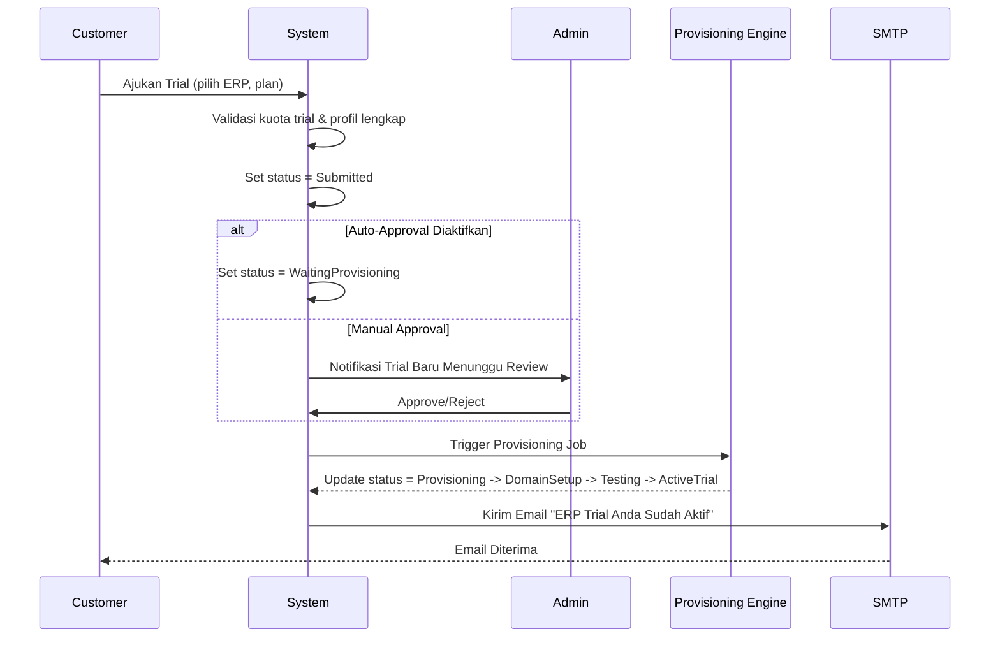
```mermaid
sequenceDiagram
    participant C as Customer
    participant SYS as System
    participant AD as Admin
    participant PROV as Provisioning Engine
    participant Mail as SMTP

    C->>SYS: Ajukan Trial (pilih ERP, plan)
    SYS->>SYS: Validasi kuota trial & profil lengkap
    SYS->>SYS: Set status = Submitted
    alt Auto-Approval Diaktifkan
        SYS->>SYS: Set status = WaitingProvisioning
    else Manual Approval
        SYS->>AD: Notifikasi Trial Baru Menunggu Review
        AD->>SYS: Approve/Reject
    end
    SYS->>PROV: Trigger Provisioning Job
    PROV-->>SYS: Update status = Provisioning -> DomainSetup -> Testing -> ActiveTrial
    SYS->>Mail: Kirim Email "ERP Trial Anda Sudah Aktif"
    Mail-->>C: Email Diterima
```

## 4.4 Business Rules
- BR-TRIAL-01: Status trial mengikuti urutan baku: `Draft → Submitted → WaitingApproval → WaitingProvisioning → Provisioning → DomainSetup → Testing → ActiveTrial`, dengan cabang `Rejected` dan `Expired`.
- BR-TRIAL-02: Trial yang `Rejected` mencantumkan alasan penolakan wajib diisi oleh Admin, dikirim ke Customer via email.
- BR-TRIAL-03: Trial `ActiveTrial` otomatis berubah menjadi `Expired` oleh scheduler harian (cron) ketika `expired_at` terlampaui, kecuali sudah dikonversi menjadi `ConvertedToSubscription`.
- BR-TRIAL-04: H-3 sebelum trial berakhir, sistem mengirim email pengingat otomatis ("Trial Anda akan berakhir dalam 3 hari").
- BR-TRIAL-05: Data tenant trial yang `Expired` tetap disimpan (soft-retained) selama 30 hari untuk kemungkinan reaktivasi, setelah itu database tenant dihapus permanen oleh scheduler pembersihan.

## 4.5 Validation Rules
| Field | Aturan |
|---|---|
| erp_product_id | required, exists, produk berstatus Published |
| subscription_plan_id | required, exists, sesuai erp_product_id |
| subdomain | required, unique, lowercase, alphanumeric-dash, max:63 karakter |
| affiliate_code | nullable, exists:affiliate_codes, valid & aktif |

## 4.6 CRUD Specification
Create (Customer), Read (Customer/Admin), Update status (Admin/System), tidak ada Delete manual — hanya soft-expire otomatis.

## 4.7 State Machine (Trial)
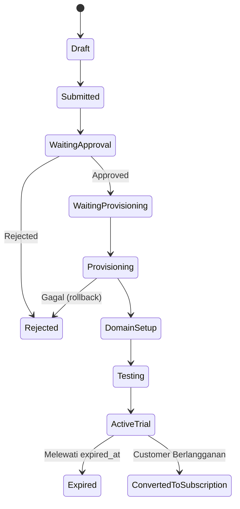
```mermaid
stateDiagram-v2
    [*] --> Draft
    Draft --> Submitted
    Submitted --> WaitingApproval
    WaitingApproval --> WaitingProvisioning: Approved
    WaitingApproval --> Rejected: Rejected
    WaitingProvisioning --> Provisioning
    Provisioning --> DomainSetup
    DomainSetup --> Testing
    Testing --> ActiveTrial
    ActiveTrial --> Expired: Melewati expired_at
    ActiveTrial --> ConvertedToSubscription: Customer Berlangganan
    Provisioning --> Rejected: Gagal (rollback)
```

## 4.8 UI Behaviour
Dashboard Customer menampilkan progress bar status trial secara visual (step indicator) beserta estimasi waktu selesai. Jika status `Rejected`, tampilkan alasan dan tombol "Ajukan Ulang".

## 4.9 API Behaviour
| Endpoint | Method |
|---|---|
| /api/v1/customer/trials | GET, POST |
| /api/v1/customer/trials/{id} | GET |
| /api/v1/admin/trials/{id}/approve | POST |
| /api/v1/admin/trials/{id}/reject | POST |

## 4.10 Error Handling
`TRIAL_QUOTA_EXCEEDED` (422) — customer sudah pernah trial produk yang sama. `TRIAL_SUBDOMAIN_TAKEN` (422). `TRIAL_PROFILE_INCOMPLETE` (403).

## 4.11 Notification
| Event | Kanal |
|---|---|
| Trial Diajukan | Email SMTP (wajib) |
| Trial Disetujui/Ditolak | Email SMTP (wajib) + WhatsApp (opsional) |
| Trial Aktif | Email SMTP (wajib) + WhatsApp (opsional) |
| Trial H-3 Akan Berakhir | Email SMTP (wajib) |
| Trial Expired | Email SMTP (wajib) |

## 4.12 Permission Matrix
Customer: Create & Read (miliknya). Admin: Read semua, Approve/Reject. System: Update status otomatis.

## 4.13 Activity Log & Audit Trail
Seluruh transisi status dicatat di tabel `trial_status_histories` (append-only) untuk keperluan audit dan analitik funnel konversi.

---

# Modul 5: Provisioning Engine

## 5.1 Objective
Mengotomasi pembuatan tenant ERP secara end-to-end tanpa intervensi manual pada tahap teknis.

## 5.2 Description
Merupakan job terjadwal (queued job) yang dieksekusi melalui Laravel Queue dengan **driver `database`** (bukan Redis), dipicu oleh event `TrialApproved` atau `SubscriptionPaid`. Karena keterbatasan shared hosting, seluruh job provisioning bersifat **idempotent** dan dapat di-retry aman tanpa duplikasi efek samping (menggunakan tabel `provisioning_jobs` sebagai state tracker, bukan hanya bergantung pada in-memory queue).

## 5.3 Workflow
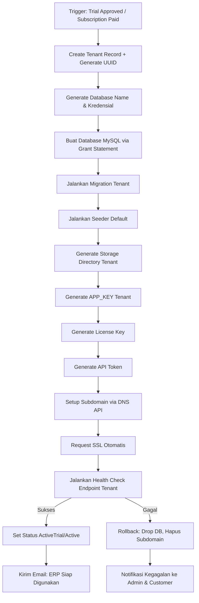
```mermaid
flowchart TD
    A[Trigger: Trial Approved / Subscription Paid] --> B[Create Tenant Record + Generate UUID]
    B --> C[Generate Database Name & Kredensial]
    C --> D[Buat Database MySQL via Grant Statement]
    D --> E[Jalankan Migration Tenant]
    E --> F[Jalankan Seeder Default]
    F --> G[Generate Storage Directory Tenant]
    G --> H[Generate APP_KEY Tenant]
    H --> I[Generate License Key]
    I --> J[Generate API Token]
    J --> K[Setup Subdomain via DNS API]
    K --> L[Request SSL Otomatis]
    L --> M[Jalankan Health Check Endpoint Tenant]
    M -->|Sukses| N[Set Status ActiveTrial/Active]
    M -->|Gagal| O[Rollback: Drop DB, Hapus Subdomain]
    O --> P[Notifikasi Kegagalan ke Admin & Customer]
    N --> Q[Kirim Email: ERP Siap Digunakan]
```

## 5.4 Business Rules
- BR-PROV-01: Setiap step provisioning dicatat statusnya secara granular di tabel `provisioning_jobs` (`step`, `status`, `attempt`, `error_message`) agar proses dapat di-resume dari step terakhir yang gagal, bukan mengulang dari awal.
- BR-PROV-02: Maksimal 3 kali retry otomatis per step dengan exponential backoff (1 menit, 5 menit, 15 menit) dijalankan melalui Cron Job scheduler (`php artisan schedule:run`), karena tidak tersedia Supervisor untuk queue worker yang berjalan terus-menerus.
- BR-PROV-03: Apabila retry ke-3 tetap gagal, job berstatus `Failed` dan wajib ditangani manual oleh Admin melalui Admin Panel (tombol "Retry Manual" atau "Rollback Manual").
- BR-PROV-04: Nama database tenant mengikuti pola `cooca_tenant_{uuid_short}` untuk menghindari konflik nama pada shared hosting yang membatasi jumlah database per akun.
- BR-PROV-05: Health check dilakukan dengan memanggil endpoint `/api/health` milik aplikasi ERP tenant; provisioning dianggap sukses hanya jika response `200 OK` dengan payload status `ok`.

## 5.5 Validation Rules
Provisioning config divalidasi terhadap JSON Schema yang didefinisikan per ERP Product (lihat Modul 3) sebelum job dieksekusi.

## 5.6 CRUD Specification
Provisioning Job bersifat sistem-generated; Admin hanya dapat melakukan **Read** dan aksi **Retry/Rollback** (bukan create/update manual field).

## 5.7 State Machine (Provisioning Job)
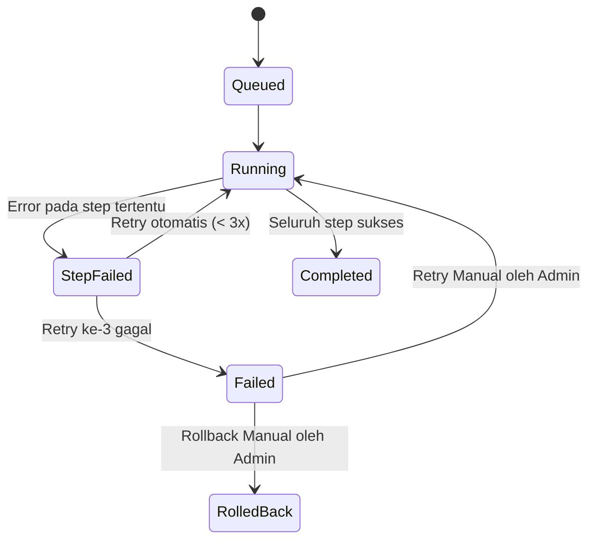
```mermaid
stateDiagram-v2
    [*] --> Queued
    Queued --> Running
    Running --> StepFailed: Error pada step tertentu
    StepFailed --> Running: Retry otomatis (< 3x)
    StepFailed --> Failed: Retry ke-3 gagal
    Running --> Completed: Seluruh step sukses
    Failed --> Running: Retry Manual oleh Admin
    Failed --> RolledBack: Rollback Manual oleh Admin
```

## 5.8 UI Behaviour
Admin Panel menampilkan log real-time per step (timeline vertikal) dengan indikator warna (hijau=sukses, kuning=proses, merah=gagal) serta tombol aksi kontekstual sesuai status.

## 5.9 API Behaviour
| Endpoint | Method | Auth |
|---|---|---|
| /api/v1/admin/provisioning-jobs | GET | Admin |
| /api/v1/admin/provisioning-jobs/{id}/retry | POST | Admin |
| /api/v1/admin/provisioning-jobs/{id}/rollback | POST | Admin |

## 5.10 Error Handling
Setiap error step disimpan lengkap dengan stack trace (development) atau pesan generik (production) pada `error_message`, kode error terstandar `PROV_STEP_{STEP_NAME}_FAILED`.

## 5.11 Notification
| Event | Kanal |
|---|---|
| Provisioning Dimulai | Email SMTP (wajib, ke Customer) |
| Provisioning Sukses | Email SMTP (wajib) + WhatsApp (opsional) berisi URL, license key |
| Provisioning Gagal (final) | Email SMTP (wajib, ke Customer dan Admin) |

## 5.12 Permission Matrix
Hanya Admin dan System (internal) yang memiliki akses ke modul ini; Customer hanya melihat status ringkas melalui Modul Trial/Subscription.

## 5.13 Activity Log & Audit Trail
Seluruh step tercatat permanen (append-only, tidak dapat dihapus) untuk keperluan audit teknis dan investigasi insiden.

---

# Modul 6: Subscription Management

## 6.1 Objective
Mengelola status berlangganan tenant, termasuk aktivasi, perpanjangan, upgrade/downgrade paket, dan pembatalan.

## 6.2 Description
Subscription terhubung langsung dengan Invoice, Payment, dan License. Setiap siklus pembayaran berhasil memperpanjang `active_until` dan memicu recurring commission bila berasal dari referral affiliate.

## 6.3 Workflow
Lihat Payment Flow pada dokumen utama Bagian "PAYMENT FLOW". Detail perpanjangan otomatis:

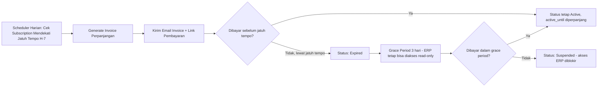
```mermaid
flowchart LR
    A[Scheduler Harian: Cek Subscription Mendekati Jatuh Tempo H-7] --> B[Generate Invoice Perpanjangan]
    B --> C[Kirim Email Invoice + Link Pembayaran]
    C --> D{Dibayar sebelum jatuh tempo?}
    D -->|Ya| E[Status tetap Active, active_until diperpanjang]
    D -->|Tidak, lewat jatuh tempo| F[Status: Expired]
    F --> G[Grace Period 3 hari - ERP tetap bisa diakses read-only]
    G --> H{Dibayar dalam grace period?}
    H -->|Ya| E
    H -->|Tidak| I[Status: Suspended - akses ERP diblokir]
```

## 6.4 Business Rules
- BR-SUB-01: Status subscription baku: `Pending → WaitingPayment → Paid → Active → Expired → Suspended/Cancelled/Renewed`.
- BR-SUB-02: Upgrade paket berlaku segera (prorated billing dihitung otomatis berdasarkan sisa hari); downgrade paket berlaku pada awal siklus berikutnya (tidak prorata).
- BR-SUB-03: Pembatalan (`Cancelled`) oleh Customer tetap memberikan akses hingga akhir periode yang sudah dibayar (tidak ada refund otomatis).
- BR-SUB-04: Grace period keterlambatan pembayaran adalah 3 hari sebelum status berubah menjadi `Suspended`.
- BR-SUB-05: Subscription `Suspended` lebih dari 30 hari tanpa pelunasan akan memicu proses penghentian tenant (data diarsipkan, akses dinonaktifkan total).

## 6.5 Validation Rules
Perubahan plan tervalidasi terhadap ketersediaan plan aktif pada produk ERP terkait; tidak dapat downgrade ke plan yang sudah dihapus/dinonaktifkan Admin.

## 6.6 CRUD Specification
Create (System, dari konversi trial atau langsung subscribe), Update (Customer untuk upgrade/downgrade/cancel; System untuk perpanjangan otomatis), tidak ada Delete (gunakan status `Cancelled`).

## 6.7 State Machine
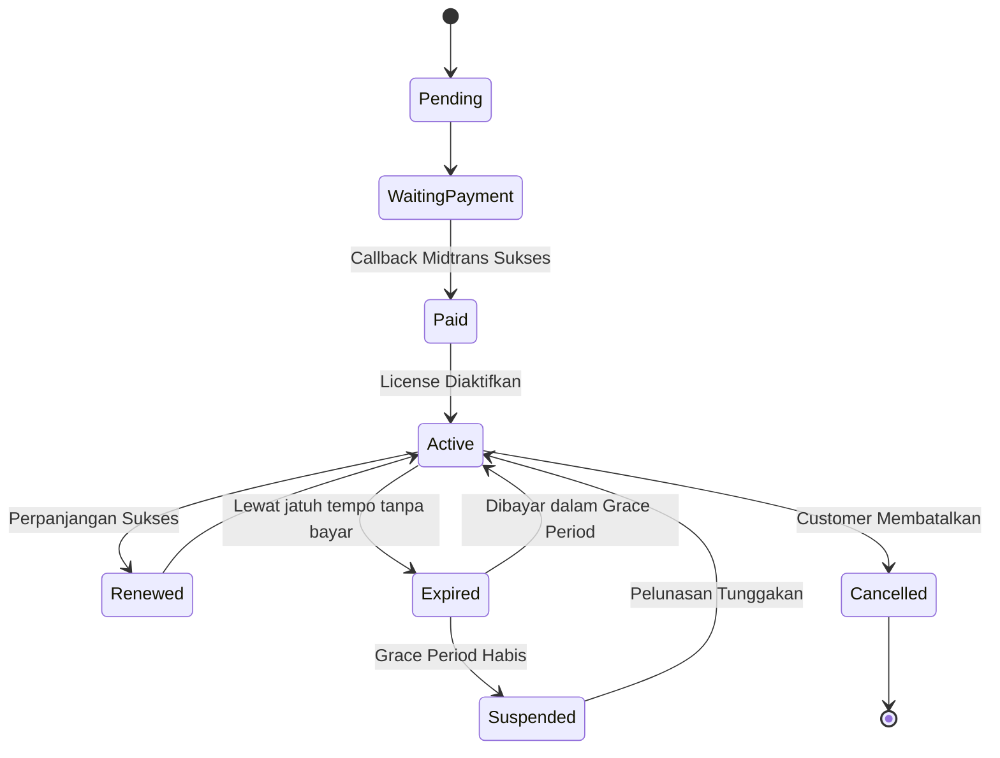
```mermaid
stateDiagram-v2
    [*] --> Pending
    Pending --> WaitingPayment
    WaitingPayment --> Paid: Callback Midtrans Sukses
    Paid --> Active: License Diaktifkan
    Active --> Renewed: Perpanjangan Sukses
    Renewed --> Active
    Active --> Expired: Lewat jatuh tempo tanpa bayar
    Expired --> Active: Dibayar dalam Grace Period
    Expired --> Suspended: Grace Period Habis
    Suspended --> Active: Pelunasan Tunggakan
    Active --> Cancelled: Customer Membatalkan
    Cancelled --> [*]
```

## 6.8 UI Behaviour
Halaman Subscription menampilkan kartu status dengan badge warna sesuai status, tombol kontekstual (Upgrade, Downgrade, Perpanjang Sekarang, Batalkan), serta riwayat siklus pembayaran dalam tabel.

## 6.9 API Behaviour
| Endpoint | Method |
|---|---|
| /api/v1/customer/subscriptions | GET, POST |
| /api/v1/customer/subscriptions/{id}/upgrade | POST |
| /api/v1/customer/subscriptions/{id}/downgrade | POST |
| /api/v1/customer/subscriptions/{id}/cancel | POST |

## 6.10 Error Handling
`SUB_PLAN_UNAVAILABLE` (422), `SUB_ALREADY_CANCELLED` (409), `SUB_DOWNGRADE_NOT_ALLOWED_MID_CYCLE` (422 — jika dikonfigurasi ketat oleh Admin).

## 6.11 Notification
Email SMTP wajib untuk seluruh transisi: aktivasi, pengingat H-7/H-3/H-1 sebelum jatuh tempo, keterlambatan (grace period), suspend, dan pembatalan.

## 6.12 Permission Matrix
Customer: kelola subscription miliknya. Admin: Read semua, override status manual (misal pembatalan akibat pelanggaran ToS).

## 6.13 Activity Log & Audit Trail
Tabel `subscription_status_histories` mencatat seluruh transisi lengkap dengan `triggered_by` (system/customer/admin).

---

# Modul 7: Invoice & Payment (Midtrans Integration)

## 7.1 Objective
Menangani penerbitan invoice dan pemrosesan pembayaran secara aman melalui Midtrans Snap.

## 7.2 Description
Setiap transaksi (trial-to-paid, perpanjangan, upgrade) menghasilkan satu record Invoice yang terhubung ke satu Midtrans Transaction. Callback ditangani dengan validasi signature ketat untuk mencegah pemalsuan status pembayaran.

## 7.3 Workflow
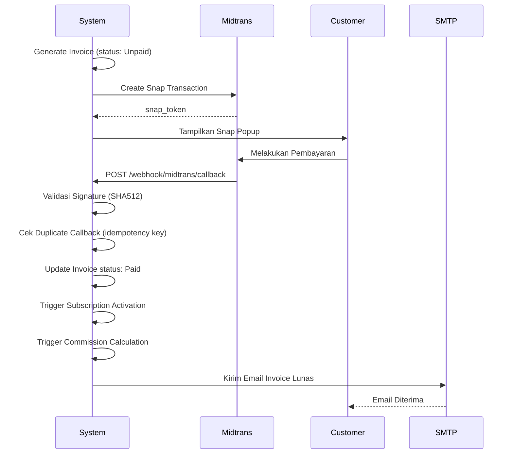
```mermaid
sequenceDiagram
    participant SYS as System
    participant MT as Midtrans
    participant C as Customer
    participant Mail as SMTP

    SYS->>SYS: Generate Invoice (status: Unpaid)
    SYS->>MT: Create Snap Transaction
    MT-->>SYS: snap_token
    SYS->>C: Tampilkan Snap Popup
    C->>MT: Melakukan Pembayaran
    MT->>SYS: POST /webhook/midtrans/callback
    SYS->>SYS: Validasi Signature (SHA512)
    SYS->>SYS: Cek Duplicate Callback (idempotency key)
    SYS->>SYS: Update Invoice status: Paid
    SYS->>SYS: Trigger Subscription Activation
    SYS->>SYS: Trigger Commission Calculation
    SYS->>Mail: Kirim Email Invoice Lunas
    Mail-->>C: Email Diterima
```

## 7.4 Business Rules
- BR-PAY-01: Signature callback Midtrans divalidasi menggunakan kombinasi `order_id + status_code + gross_amount + server_key` (SHA512) sebelum status invoice diubah.
- BR-PAY-02: Setiap callback disimpan di tabel `payment_logs` dengan `raw_payload` lengkap sebelum diproses, untuk keperluan rekonsiliasi dan audit.
- BR-PAY-03: Callback duplikat (order_id + transaction_status yang sama) diabaikan (idempotent) dan hanya dicatat sebagai log, tidak memicu efek samping berulang (misal komisi ganda).
- BR-PAY-04: Invoice yang tidak dibayar dalam 24 jam (status Midtrans `expire`) otomatis berstatus `Expired` dan customer dapat generate invoice baru.
- BR-PAY-05: Nominal invoice mencantumkan rincian: harga plan, biaya provisioning (jika ada), biaya domain kustom (jika ada), dikurangi diskon kupon (jika ada), tanpa pembulatan yang mengubah total lebih dari Rp 1.

## 7.5 Validation Rules
Signature request callback wajib valid; jika tidak valid, request ditolak dengan HTTP 403 dan dicatat sebagai `SUSPICIOUS_CALLBACK` di security log.

## 7.6 CRUD Specification
Invoice: Create (System), Read (Customer/Admin), tidak ada Update manual nominal (hanya melalui proses kupon/adjustment resmi oleh Admin dengan audit trail wajib), tidak ada Delete.

## 7.7 State Machine (Invoice)
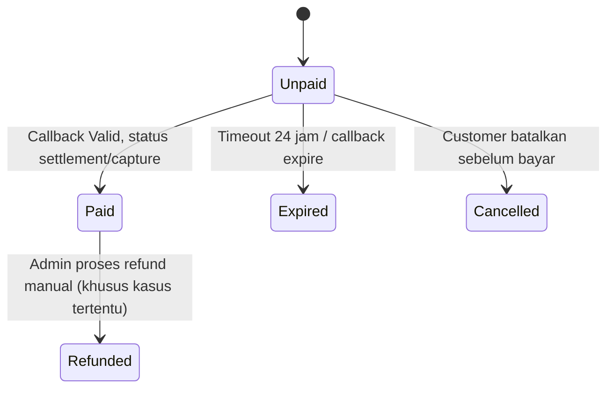
```mermaid
stateDiagram-v2
    [*] --> Unpaid
    Unpaid --> Paid: Callback Valid, status settlement/capture
    Unpaid --> Expired: Timeout 24 jam / callback expire
    Unpaid --> Cancelled: Customer batalkan sebelum bayar
    Paid --> Refunded: Admin proses refund manual (khusus kasus tertentu)
```

## 7.8 UI Behaviour
Snap popup Midtrans ditampilkan sebagai modal overlay; halaman Invoice List menampilkan status dengan badge dan tombol "Bayar Sekarang" untuk invoice `Unpaid`, tombol "Unduh PDF" untuk invoice `Paid`.

## 7.9 API Behaviour
| Endpoint | Method | Auth |
|---|---|---|
| /api/v1/customer/invoices | GET | Sanctum |
| /api/v1/customer/invoices/{id}/pay | POST | Sanctum |
| /webhook/midtrans/callback | POST | Signature Validation (bukan Sanctum) |

## 7.10 Error Handling
`PAY_SIGNATURE_INVALID` (403), `PAY_INVOICE_ALREADY_PAID` (409, callback diabaikan), `PAY_GATEWAY_TIMEOUT` (retry otomatis via job).

## 7.11 Notification
Email SMTP wajib: Invoice diterbitkan, Invoice lunas, Invoice akan kedaluwarsa (H-1), Invoice kedaluwarsa.

## 7.12 Permission Matrix
Customer: Read & Pay invoice miliknya. Admin: Read semua, proses refund manual dengan approval dua langkah (maker-checker).

## 7.13 Activity Log & Audit Trail
`payment_logs` menyimpan seluruh raw payload callback (append-only, tidak dapat diubah) sebagai bukti audit finansial yang tidak dapat disangkal (non-repudiation).

---

# Modul 8: Affiliate Program

## 8.1 Objective
Mengelola pendaftaran affiliator, tracking referral, kalkulasi komisi dua level, dan pencairan dana.

## 8.2 Description
Menggunakan mekanisme kode referral unik dan cookie/parameter tracking pada link. Komisi dihitung otomatis pada setiap pembayaran invoice yang berhasil, dengan struktur Level 1 (25%, direct) dan Level 2 (5%, upline dari Level 1).

## 8.3 Workflow
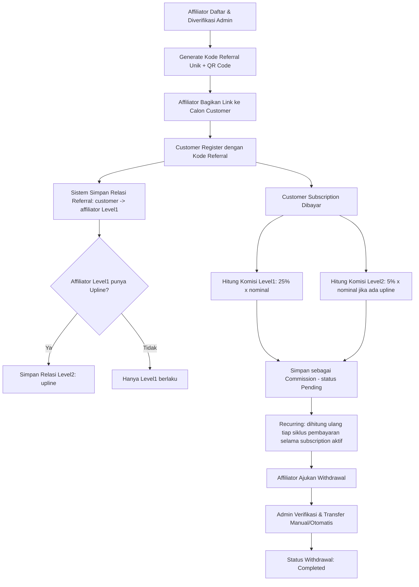
```mermaid
flowchart TD
    A[Affiliator Daftar & Diverifikasi Admin] --> B[Generate Kode Referral Unik + QR Code]
    B --> C[Affiliator Bagikan Link ke Calon Customer]
    C --> D[Customer Register dengan Kode Referral]
    D --> E[Sistem Simpan Relasi Referral: customer -> affiliator Level1]
    E --> F{Affiliator Level1 punya Upline?}
    F -->|Ya| G[Simpan Relasi Level2: upline]
    F -->|Tidak| H[Hanya Level1 berlaku]
    D --> I[Customer Subscription Dibayar]
    I --> J[Hitung Komisi Level1: 25% x nominal]
    I --> K[Hitung Komisi Level2: 5% x nominal jika ada upline]
    J --> L[Simpan sebagai Commission - status Pending]
    K --> L
    L --> M[Recurring: dihitung ulang tiap siklus pembayaran selama subscription aktif]
    M --> N[Affiliator Ajukan Withdrawal]
    N --> O[Admin Verifikasi & Transfer Manual/Otomatis]
    O --> P[Status Withdrawal: Completed]
```

## 8.4 Business Rules
- BR-AFF-01: Kode referral bersifat permanen per affiliator dan tidak dapat diubah setelah generate pertama (kecuali oleh Admin dalam kasus khusus dengan audit log).
- BR-AFF-02: Relasi referral (customer → affiliator) ditetapkan pada saat registrasi dan bersifat final — tidak dapat dipindahkan ke affiliator lain di kemudian hari (mencegah "referral hijacking").
- BR-AFF-03: Komisi Level 1 = 25% dari nominal invoice yang berhasil dibayar (net setelah diskon kupon, sebelum PPN jika berlaku).
- BR-AFF-04: Komisi Level 2 = 5% dari nominal invoice yang sama, diberikan kepada affiliator upline dari affiliator Level 1 (struktur maksimal 2 level, tidak ada Level 3 dan seterusnya).
- BR-AFF-05: Komisi berstatus `Pending` selama 14 hari (masa hold untuk mengantisipasi refund/chargeback) sebelum berubah menjadi `Available` dan dapat dicairkan.
- BR-AFF-06: Minimal nominal withdrawal adalah Rp 100.000; withdrawal diproses maksimal dalam 3 hari kerja setelah pengajuan.
- BR-AFF-07: Recurring commission dihentikan otomatis apabila subscription customer terkait berstatus `Cancelled` atau `Suspended` lebih dari 30 hari.

## 8.5 Validation Rules
Kode referral tervalidasi unik dan aktif; withdrawal memerlukan data rekening bank/e-wallet yang telah diverifikasi.

## 8.6 CRUD Specification
Affiliator: Read komisi & referral miliknya, Create withdrawal request. Admin: Full CRUD atas seluruh data affiliate untuk keperluan moderasi.

## 8.7 State Machine (Commission)
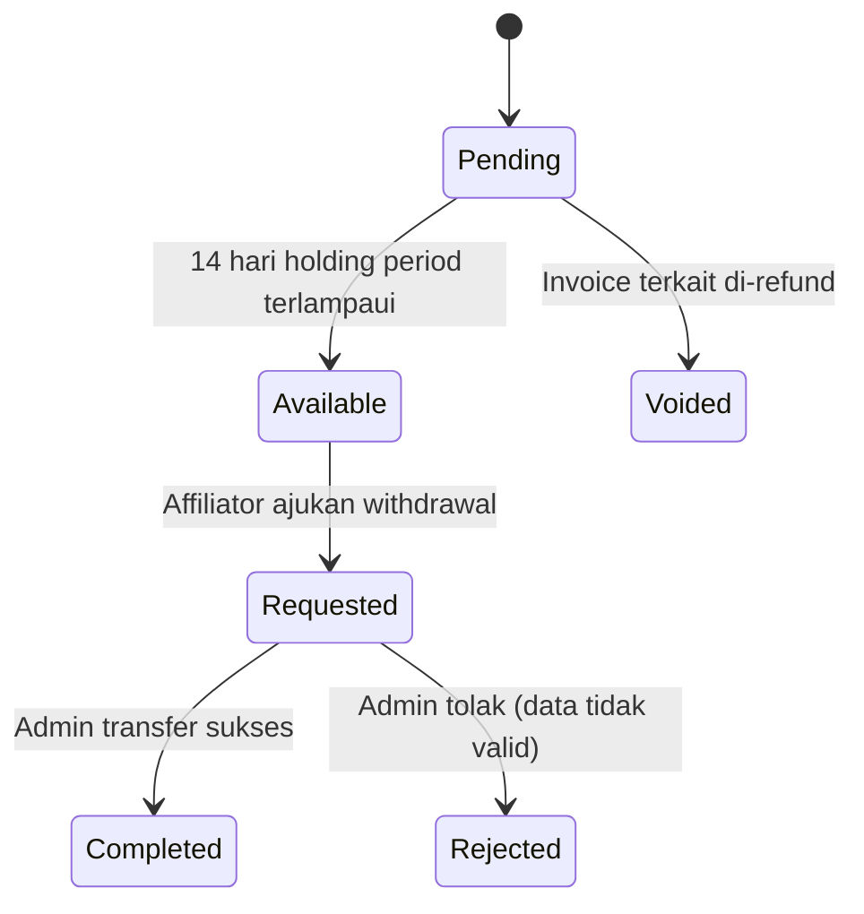
```mermaid
stateDiagram-v2
    [*] --> Pending
    Pending --> Available: 14 hari holding period terlampaui
    Pending --> Voided: Invoice terkait di-refund
    Available --> Requested: Affiliator ajukan withdrawal
    Requested --> Completed: Admin transfer sukses
    Requested --> Rejected: Admin tolak (data tidak valid)
```

## 8.8 UI Behaviour
Dashboard Affiliator menampilkan ringkasan: Total Komisi, Komisi Pending, Komisi Available, grafik tren referral bulanan, serta tabel riwayat komisi per transaksi referral.

## 8.9 API Behaviour
| Endpoint | Method |
|---|---|
| /api/v1/affiliator/referrals | GET |
| /api/v1/affiliator/commissions | GET |
| /api/v1/affiliator/withdrawals | GET, POST |
| /api/v1/admin/withdrawals/{id}/approve | POST |

## 8.10 Error Handling
`AFF_WITHDRAWAL_BELOW_MINIMUM` (422), `AFF_INSUFFICIENT_AVAILABLE_BALANCE` (422), `AFF_BANK_ACCOUNT_NOT_VERIFIED` (403).

## 8.11 Notification
Email SMTP wajib: Komisi baru diterima (Pending), Komisi menjadi Available, Withdrawal disetujui/ditolak, Withdrawal selesai ditransfer.

## 8.12 Permission Matrix
Affiliator: kelola data miliknya. Admin: approve/reject withdrawal, override komisi (dengan audit trail wajib mencantumkan alasan).

## 8.13 Activity Log & Audit Trail
Seluruh kalkulasi komisi dicatat dengan referensi eksplisit ke `invoice_id` sumber, memastikan setiap nominal komisi dapat ditelusuri (traceable) ke transaksi asal.

---

# Modul 9: Domain & License Management

## 9.1 Objective
Mengelola subdomain gratis, custom domain berbayar, SSL, serta penerbitan dan validasi License Key.

## 9.2 Description
Subdomain otomatis dibuat pada saat provisioning (`{subdomain}.cooca.id`). Custom domain memerlukan verifikasi kepemilikan melalui DNS TXT record sebelum diaktifkan.

## 9.3 Workflow (Custom Domain)
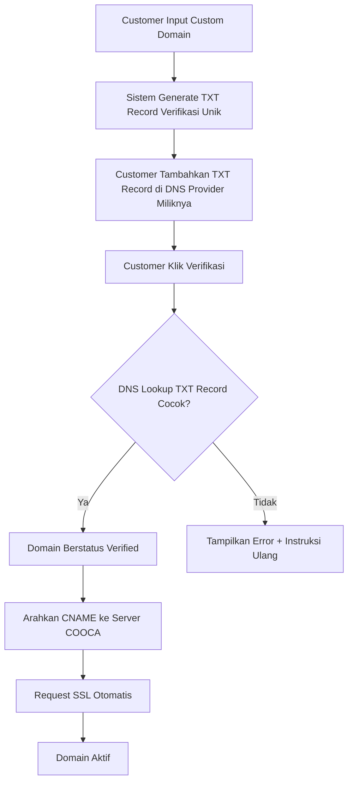
```mermaid
flowchart TD
    A[Customer Input Custom Domain] --> B[Sistem Generate TXT Record Verifikasi Unik]
    B --> C[Customer Tambahkan TXT Record di DNS Provider Miliknya]
    C --> D[Customer Klik Verifikasi]
    D --> E{DNS Lookup TXT Record Cocok?}
    E -->|Ya| F[Domain Berstatus Verified]
    E -->|Tidak| G[Tampilkan Error + Instruksi Ulang]
    F --> H[Arahkan CNAME ke Server COOCA]
    H --> I[Request SSL Otomatis]
    I --> J[Domain Aktif]
```

## 9.4 Business Rules
- BR-DOM-01: Satu tenant hanya dapat memiliki satu domain aktif (subdomain ATAU custom domain) pada satu waktu; mengaktifkan custom domain otomatis menonaktifkan subdomain (redirect 301).
- BR-DOM-02: Verifikasi custom domain kedaluwarsa dalam 72 jam; jika tidak diverifikasi, request domain dibatalkan otomatis.
- BR-DOM-03: License Key di-generate menggunakan kombinasi UUID tenant + signature kriptografis yang divalidasi oleh aplikasi ERP tenant setiap kali start-up.
- BR-DOM-04: License Key dirotasi (regenerate, invalidasi key lama) apabila terdeteksi penggunaan di domain yang tidak terdaftar terhadap tenant tersebut.
- BR-DOM-05: API Token mengikuti masa berlaku (expiry) yang dapat dikonfigurasi customer (7/30/90 hari/tanpa kedaluwarsa dengan peringatan keamanan).

## 9.5 Validation Rules
Format domain divalidasi RFC 1035; custom domain tidak boleh sudah terdaftar di tenant lain.

## 9.6 CRUD Specification
Customer: Create/Update domain miliknya. Admin: Read semua, override verifikasi manual bila diperlukan (misal kendala DNS propagation).

## 9.7 State Machine (Domain)
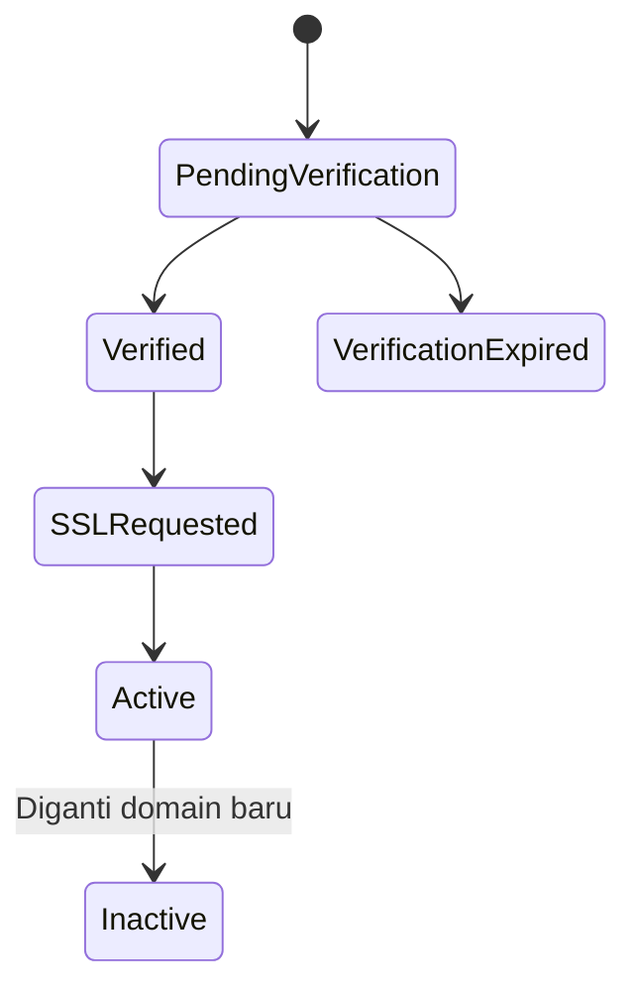
```mermaid
stateDiagram-v2
    [*] --> PendingVerification
    PendingVerification --> Verified
    PendingVerification --> VerificationExpired
    Verified --> SSLRequested
    SSLRequested --> Active
    Active --> Inactive: Diganti domain baru
```

## 9.8 UI Behaviour
Halaman Domain menampilkan status verifikasi dengan instruksi copy-paste TXT record, tombol "Cek Verifikasi", dan indikator progres SSL.

## 9.9 API Behaviour
| Endpoint | Method |
|---|---|
| /api/v1/customer/domains | GET, POST |
| /api/v1/customer/domains/{id}/verify | POST |
| /api/v1/customer/license | GET |
| /api/v1/customer/api-tokens | GET, POST, DELETE |

## 9.10 Error Handling
`DOMAIN_VERIFICATION_FAILED` (422), `DOMAIN_ALREADY_REGISTERED` (409), `LICENSE_INVALID_SIGNATURE` (403 — dipanggil dari sisi aplikasi ERP tenant).

## 9.11 Notification
Email SMTP wajib: Domain berhasil diverifikasi, SSL aktif, License Key diperbarui/dirotasi (dengan peringatan keamanan bila rotasi dipicu oleh kecurigaan pelanggaran).

## 9.12 Permission Matrix
Customer: kelola domain & token miliknya. Admin: override & investigasi pelanggaran lisensi.

## 9.13 Activity Log & Audit Trail
Setiap rotasi License Key dan pembuatan/pencabutan API Token dicatat lengkap dengan alasan dan actor.

---

# Modul 10: Notification System (Email SMTP & WhatsApp)

## 10.1 Objective
Menyediakan infrastruktur pengiriman notifikasi terpusat, konsisten, dan dapat diaudit untuk seluruh modul di atas.

## 10.2 Description
Modul ini adalah **layanan lintas-modul (cross-cutting service)** yang dipanggil oleh seluruh modul lain. Menggunakan pola **Notification Queue** (driver `database`) agar pengiriman email tidak memblokir response API, dieksekusi oleh Cron Job setiap menit.

**Kanal Wajib:** Email SMTP — digunakan untuk SELURUH jenis notifikasi transaksional dan sistem tanpa terkecuali.
**Kanal Tambahan (Opsional per tenant/customer):** WhatsApp via Fonnte API — hanya untuk notifikasi tertentu yang bersifat time-sensitive (misal trial aktif, pengingat jatuh tempo).

## 10.3 Workflow
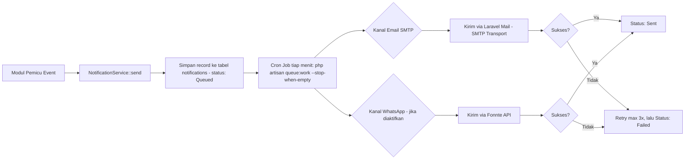
```mermaid
flowchart LR
    A[Modul Pemicu Event] --> B[NotificationService::send]
    B --> C[Simpan record ke tabel notifications - status: Queued]
    C --> D[Cron Job tiap menit: php artisan queue:work --stop-when-empty]
    D --> E{Kanal Email SMTP}
    D --> F{Kanal WhatsApp - jika diaktifkan}
    E --> G[Kirim via Laravel Mail - SMTP Transport]
    F --> H[Kirim via Fonnte API]
    G --> I{Sukses?}
    H --> J{Sukses?}
    I -->|Ya| K[Status: Sent]
    I -->|Tidak| L[Retry max 3x, lalu Status: Failed]
    J -->|Ya| K
    J -->|Tidak| L
```

## 10.4 Business Rules
- BR-NOTIF-01: Setiap event bisnis yang tercantum pada Bagian 10.6 (Daftar Event) WAJIB memiliki record notifikasi Email SMTP; tidak ada modul yang boleh melewatkan (skip) pengiriman email untuk event tersebut.
- BR-NOTIF-02: Kegagalan pengiriman WhatsApp TIDAK memengaruhi status notifikasi Email SMTP (kanal independen); status disimpan terpisah per kanal.
- BR-NOTIF-03: Template email menggunakan Blade Mailable dengan data terikat (bound data) — tidak ada string concatenation manual untuk mencegah injection pada konten email.
- BR-NOTIF-04: Retry pengiriman maksimal 3 kali dengan jeda 5 menit; setelah gagal permanen, dicatat sebagai `Failed` dan ditampilkan pada Admin Panel > Notification Log untuk investigasi manual (misal SMTP quota habis).
- BR-NOTIF-05: Rate limiting pengiriman email dijaga agar tidak melebihi kuota harian SMTP provider (dikonfigurasi di Admin Setting > SMTP), dengan job dijeda otomatis (throttle) jika mendekati limit.

## 10.5 Validation Rules
Alamat email tujuan divalidasi format sebelum dikirim; nomor WhatsApp divalidasi format Indonesia (+62) sebelum dikirim ke Fonnte.

## 10.6 Daftar Event & Kanal (Konsolidasi Seluruh Modul)

| Event | Email SMTP | WhatsApp |
|---|---|---|
| Registrasi & Verifikasi Email | Wajib | - |
| Reset Password | Wajib | - |
| Login Perangkat Baru | Wajib | Opsional |
| Profil Perusahaan Diperbarui | Wajib | - |
| Trial Diajukan/Disetujui/Ditolak/Aktif/Expired | Wajib | Opsional |
| Provisioning Dimulai/Sukses/Gagal | Wajib | Opsional |
| Subscription Aktif/Perpanjangan/Suspend/Cancel | Wajib | Opsional |
| Invoice Diterbitkan/Lunas/Kedaluwarsa | Wajib | Opsional |
| Domain Terverifikasi/SSL Aktif | Wajib | - |
| License Key Dirotasi | Wajib | - |
| Komisi Baru/Available | Wajib | Opsional |
| Withdrawal Disetujui/Ditolak/Selesai | Wajib | Opsional |
| Ticket Baru/Dibalas/Ditutup | Wajib | Opsional |

## 10.7 CRUD Specification
Notification bersifat sistem-generated (Create otomatis); Admin dapat **Read** log dan mengelola **Template** (CRUD Email Template & WhatsApp Template).

## 10.8 State Machine (Notification)
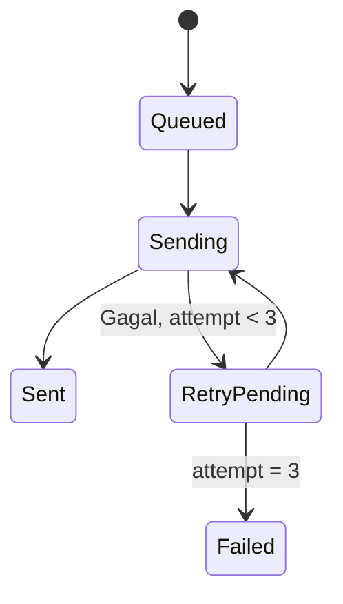
```mermaid
stateDiagram-v2
    [*] --> Queued
    Queued --> Sending
    Sending --> Sent
    Sending --> RetryPending: Gagal, attempt < 3
    RetryPending --> Sending
    RetryPending --> Failed: attempt = 3
```

## 10.9 UI Behaviour
Admin Panel > Notification Log menampilkan tabel filterable (per event, per kanal, per status) dengan detail payload dan alasan kegagalan.

## 10.10 API Behaviour
| Endpoint | Method |
|---|---|
| /api/v1/admin/notifications | GET |
| /api/v1/admin/notification-templates | GET, POST, PUT |
| /api/v1/admin/settings/smtp | GET, PUT |
| /api/v1/admin/settings/whatsapp | GET, PUT |

## 10.11 Error Handling
`NOTIF_SMTP_CONNECTION_FAILED`, `NOTIF_TEMPLATE_NOT_FOUND`, `NOTIF_WHATSAPP_API_ERROR` — seluruhnya di-log tanpa menghentikan alur bisnis utama (notifikasi bersifat fire-and-forget dari perspektif proses bisnis inti).

## 10.12 Permission Matrix
Admin: kelola template dan setting SMTP/WhatsApp. Customer/Affiliator: hanya menerima, tidak memiliki akses ke modul ini.

## 10.13 Activity Log & Audit Trail
Seluruh notifikasi tersimpan permanen di tabel `notifications` sebagai bukti komunikasi resmi kepada customer (penting untuk sengketa/dispute).

---

# Modul 11: Ticketing & Support

## 11.1 Objective
Menyediakan kanal dukungan terstruktur bagi Customer dan Affiliator dengan SLA tracking.

## 11.2 Business Rules
- BR-TICKET-01: Setiap ticket memiliki prioritas (`Low`, `Normal`, `High`, `Urgent`) dengan SLA berbeda (72 jam, 24 jam, 8 jam, 2 jam untuk respons pertama).
- BR-TICKET-02: Ticket yang tidak direspons Admin melewati SLA otomatis di-escalate (notifikasi ke Admin Manager) dan dicatat sebagai SLA breach untuk pelaporan performa.
- BR-TICKET-03: Ticket dapat ditutup otomatis oleh sistem apabila tidak ada balasan dari Customer selama 7 hari setelah balasan terakhir Admin.

## 11.3 State Machine
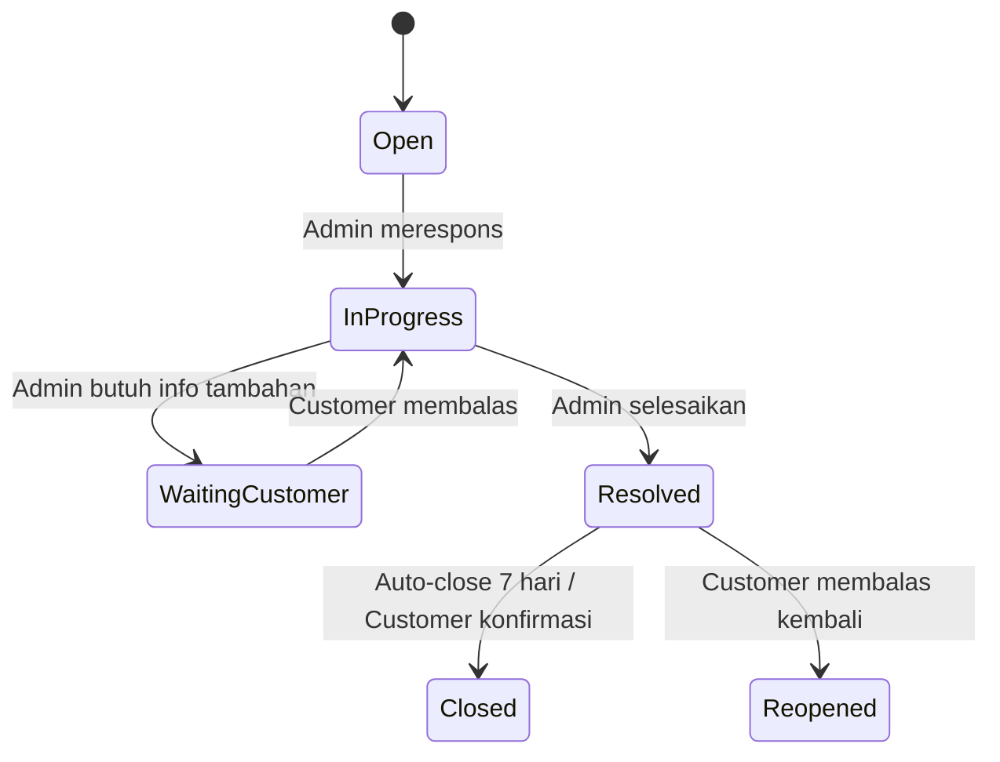
```mermaid
stateDiagram-v2
    [*] --> Open
    Open --> InProgress: Admin merespons
    InProgress --> WaitingCustomer: Admin butuh info tambahan
    WaitingCustomer --> InProgress: Customer membalas
    InProgress --> Resolved: Admin selesaikan
    Resolved --> Closed: Auto-close 7 hari / Customer konfirmasi
    Resolved --> Reopened: Customer membalas kembali
```

## 11.4 Notification
Email SMTP wajib untuk: ticket dibuat, dibalas, status berubah, dan ditutup.

## 11.5 Permission Matrix
Customer/Affiliator: buat & lihat ticket miliknya. Admin: kelola seluruh ticket, assign ke agent tertentu.

## 11.6 Activity Log & Audit Trail
Seluruh balasan tersimpan sebagai thread lengkap dengan timestamp untuk keperluan SLA reporting dan audit layanan.

---

# Modul 12: CMS (Landing Page, Blog, FAQ, Documentation)

## 12.1 Objective
Mengelola konten publik untuk keperluan marketing dan edukasi produk.

## 12.2 Business Rules
- BR-CMS-01: Seluruh konten publik (Blog, FAQ, Documentation) melalui status `Draft → Review → Published` sebelum tampil di Guest Panel.
- BR-CMS-02: SEO metadata (meta title, meta description, slug, OG image) wajib diisi sebelum konten dapat berstatus `Published`.

## 12.3 State Machine
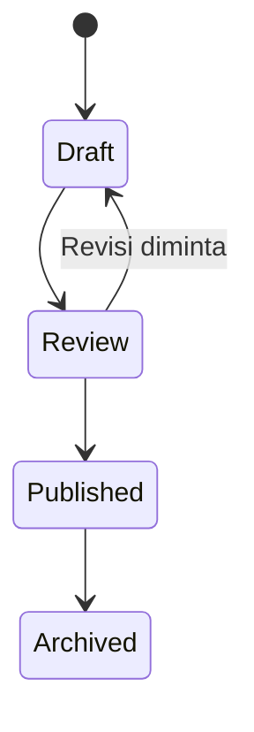
```mermaid
stateDiagram-v2
    [*] --> Draft
    Draft --> Review
    Review --> Published
    Review --> Draft: Revisi diminta
    Published --> Archived
```

## 12.4 Permission Matrix
Content Admin: CRUD penuh. Marketing Lead: approve dari Review ke Published. Guest: Read-only konten Published.

## 12.5 Notification
Email SMTP internal ke Content Admin saat ada permintaan review baru; tidak ada notifikasi ke Customer/Guest untuk modul ini.

---

*Lanjut ke Bagian 3: Software Requirement Specification (SRS) pada file `03-srs.md`.*
