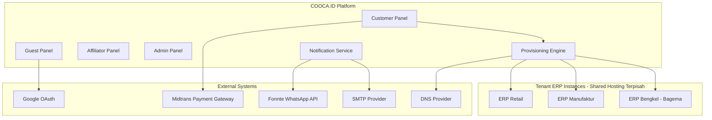

# COOCA.ID — Software Requirement Specification (SRS)
## Bagian 3 dari Rangkaian Dokumentasi — Mengacu pada IEEE 830/29148

---

# 1. Introduction

## 1.1 Purpose
Dokumen ini mendefinisikan kebutuhan perangkat lunak untuk platform COOCA.ID secara rinci dan dapat diverifikasi, sebagai acuan tunggal bagi tim pengembang backend, frontend, QA, dan DevOps.

## 1.2 Scope
SRS ini mencakup seluruh sistem COOCA.ID: Guest Panel, Customer Panel, Affiliator Panel, dan Admin Panel, beserta Provisioning Engine dan integrasi pihak ketiga (Midtrans, SMTP, Fonnte, Google OAuth).

## 1.3 Definitions, Acronyms, Abbreviations

| Istilah | Definisi |
|---|---|
| Tenant | Instance ERP yang di-provisioning untuk satu customer |
| Provisioning | Proses otomatis pembuatan tenant ERP |
| MRR | Monthly Recurring Revenue |
| SMTP | Simple Mail Transfer Protocol, protokol pengiriman email |
| Snap | Produk payment popup dari Midtrans |
| RBAC | Role Based Access Control |
| UUID | Universally Unique Identifier, digunakan sebagai primary key seluruh entitas |

## 1.4 References
Dokumen BRD/PRD (Bagian 1), FSD (Bagian 2), IEEE 830-1998, ISO/IEC/IEEE 29148-2018.

## 1.5 Overview
Dokumen disusun mengikuti struktur: Overall Description, Functional Requirement, External Interface, System Features, Database Requirement, Security Requirement, Performance Requirement, Deployment Requirement, Operational Requirement.

---

# 2. Overall Description

## 2.1 Product Perspective
COOCA.ID merupakan sistem baru (greenfield) yang berperan sebagai orchestrator terhadap produk-produk ERP independen. Sistem ini **tidak menggantikan** aplikasi ERP itu sendiri, melainkan menyediakan lapisan manajemen subscription, billing, license, dan provisioning di atasnya.

## 2.2 Product Functions
Ringkasan fungsi utama mengacu pada Feature List (PRD Bagian 6.5) dan FSD (Bagian 2).

## 2.3 User Classes and Characteristics

| Kelas Pengguna | Karakteristik |
|---|---|
| Guest | Pengunjung anonim, akses terbatas pada konten publik |
| Customer | Pemilik tenant ERP, kemampuan teknis bervariasi (asumsi non-teknis) |
| Customer Manager/Staff | Sub-user di bawah akun Customer utama dengan hak akses terbatas |
| Affiliator | Mitra pemasaran, fokus pada tracking komisi, bukan pengguna teknis |
| Admin | Staf operasional COOCA.ID dengan pemahaman teknis menengah-tinggi |
| Super Admin | Pemegang akses penuh termasuk pengaturan sistem kritikal |

## 2.4 Operating Environment
- Server: Shared Hosting berbasis cPanel/DirectAdmin dengan dukungan PHP 8.4, MySQL 8, cron job.
- Web Server: Apache (mod_php) atau LiteSpeed — bergantung pada penyedia hosting; **bukan Nginx**.
- Tidak tersedia Redis, Memcached tingkat sistem, atau Supervisor/systemd untuk proses long-running.
- Client: Web Browser modern (Chrome, Firefox, Safari, Edge versi 2 tahun terakhir), responsive untuk perangkat mobile.

## 2.5 Design and Implementation Constraints
- Wajib menggunakan Laravel 12 dan PHP 8.4.
- Queue WAJIB menggunakan driver `database` (bukan `redis`); scheduler dijalankan via satu baris cron: `* * * * * php /path/artisan schedule:run >> /dev/null 2>&1`.
- Cache dan Session menggunakan driver `database` atau `file`.
- Tidak menggunakan proses daemon kustom yang memerlukan Supervisor.
- Seluruh notifikasi WAJIB memiliki jalur Email SMTP sebagai kanal utama.

## 2.6 Assumptions and Dependencies
Sama seperti BRD Bagian 5.9–5.10.

---

# 3. Functional Requirements (Detail)

Requirement dikelompokkan per domain, dengan format ID `FR-{DOMAIN}-{NOMOR}` agar dapat ditelusuri (traceability) ke FSD dan test case terkait.

## 3.1 Domain: Authentication
| ID | Requirement | Prioritas |
|---|---|---|
| FR-AUTH-001 | Sistem harus mendukung registrasi via email/password dengan validasi kekuatan password. | Must Have |
| FR-AUTH-002 | Sistem harus mendukung login via Google OAuth 2.0. | Must Have |
| FR-AUTH-003 | Sistem harus mengirim email verifikasi dalam waktu ≤ 60 detik setelah registrasi (bergantung antrian SMTP). | Must Have |
| FR-AUTH-004 | Sistem harus menerapkan rate limiting login (5 percobaan/15 menit). | Must Have |
| FR-AUTH-005 | Sistem harus mencatat login history (IP, user agent, waktu). | Should Have |

## 3.2 Domain: Trial & Provisioning
| ID | Requirement | Prioritas |
|---|---|---|
| FR-TRIAL-001 | Sistem harus memvalidasi kuota trial per (customer, produk ERP) sebelum menerima pengajuan. | Must Have |
| FR-TRIAL-002 | Sistem harus menjalankan seluruh tahap provisioning secara asinkron melalui queue database. | Must Have |
| FR-TRIAL-003 | Sistem harus melakukan rollback otomatis jika provisioning gagal permanen (3x retry). | Must Have |
| FR-TRIAL-004 | Sistem harus mengubah status trial menjadi Expired otomatis via scheduler harian. | Must Have |

## 3.3 Domain: Subscription & Payment
| ID | Requirement | Prioritas |
|---|---|---|
| FR-SUB-001 | Sistem harus terintegrasi dengan Midtrans Snap API untuk pembuatan transaksi. | Must Have |
| FR-SUB-002 | Sistem harus memvalidasi signature callback Midtrans sebelum mengubah status invoice. | Must Have |
| FR-SUB-003 | Sistem harus menangani callback duplikat secara idempotent. | Must Have |
| FR-SUB-004 | Sistem harus menjalankan proses perpanjangan otomatis H-7 sebelum jatuh tempo. | Must Have |

## 3.4 Domain: Affiliate
| ID | Requirement | Prioritas |
|---|---|---|
| FR-AFF-001 | Sistem harus menghitung komisi Level 1 (25%) dan Level 2 (5%) otomatis pada setiap pembayaran sukses. | Must Have |
| FR-AFF-002 | Sistem harus menerapkan holding period 14 hari sebelum komisi dapat dicairkan. | Must Have |
| FR-AFF-003 | Sistem harus mendukung generate QR Code untuk link referral. | Should Have |

## 3.5 Domain: Notification
| ID | Requirement | Prioritas |
|---|---|---|
| FR-NOTIF-001 | Sistem harus mengirim seluruh notifikasi transaksional melalui Email SMTP tanpa terkecuali. | Must Have |
| FR-NOTIF-002 | Sistem harus mendukung kanal WhatsApp sebagai tambahan opsional. | Could Have |
| FR-NOTIF-003 | Sistem harus melakukan retry pengiriman maksimal 3 kali dengan jeda 5 menit. | Must Have |

## 3.6 Domain: Admin & Operasional
| ID | Requirement | Prioritas |
|---|---|---|
| FR-ADM-001 | Sistem harus menyediakan dashboard monitoring provisioning job secara real-time. | Must Have |
| FR-ADM-002 | Sistem harus mencatat activity log dan audit trail untuk seluruh aksi administratif. | Must Have |
| FR-ADM-003 | Sistem harus menyediakan RBAC granular berbasis Spatie Permission. | Must Have |

---

# 4. External Interface Requirements

## 4.1 User Interfaces
Web-based responsive UI, mendukung breakpoint mobile (< 768px), tablet (768–1024px), desktop (> 1024px). Detail lengkap pada Dokumen UI/UX Specification (Bagian 15).

## 4.2 Hardware Interfaces
Tidak ada interface hardware khusus; sistem berjalan sepenuhnya berbasis web di atas shared hosting standar.

## 4.3 Software Interfaces

| Sistem Eksternal | Protokol | Fungsi |
|---|---|---|
| Midtrans | REST API (HTTPS) | Payment processing (Snap, Notification/Callback) |
| SMTP Provider | SMTP (port 587/465, TLS) | Pengiriman seluruh notifikasi email |
| Fonnte | REST API (HTTPS) | Pengiriman notifikasi WhatsApp opsional |
| Google OAuth | OAuth 2.0 | Login sosial |
| DNS Provider (via API atau manual TXT) | DNS Lookup / Registrar API | Verifikasi dan setup custom domain |
| Tenant ERP Instances | REST API (HTTPS) | Provisioning (migration trigger, health check) |

## 4.4 Communication Interfaces
Seluruh komunikasi API menggunakan HTTPS dengan TLS 1.2 minimum. Webhook Midtrans divalidasi menggunakan HTTPS dengan signature SHA512.

---

# 5. System Features (Detail Tambahan di Luar FSD)

## 5.1 Multi-Guard Authentication
Sistem menggunakan konfigurasi multi-guard Laravel (`customer`, `affiliator`, `admin`) dengan tabel user terpisah secara logis (melalui `user_type` discriminator pada tabel `users` terpadu atau tabel terpisah — keputusan desain: **tabel terpadu `users` dengan kolom `user_type` enum**, karena mempermudah relasi referral affiliate-ke-customer yang bisa lintas tipe).

## 5.2 Idempotent Job Processing
Karena keterbatasan shared hosting (queue worker tidak berjalan permanen, hanya dipicu cron per menit), seluruh job (provisioning, commission calculation, notification) dirancang idempotent — dapat dieksekusi ulang tanpa efek samping ganda, menggunakan kombinasi unique constraint dan status check sebelum eksekusi.

## 5.3 Soft Delete Universal
Seluruh entitas transaksional (User, Trial, Subscription, Invoice, Commission) menggunakan Soft Delete (`deleted_at`) — data tidak pernah dihapus permanen kecuali melalui proses arsip terjadwal setelah periode retensi yang jelas (lihat BR-TRIAL-05).

---

# 6. Database Requirement

Dijabarkan lengkap pada Bagian 11 (Database Design). Ringkasan requirement:
- Seluruh primary key menggunakan UUID v4.
- Seluruh tabel transaksional memiliki kolom `created_at`, `updated_at`, `deleted_at`.
- Index wajib pada seluruh foreign key dan kolom yang sering difilter (status, email, slug).
- Karakter set `utf8mb4` untuk mendukung emoji dan karakter khusus pada konten CMS.

---

# 7. Security Requirement

Dijabarkan lengkap pada Bagian 14 (Security Design). Ringkasan requirement:
- Password di-hash menggunakan bcrypt/argon2id (default Laravel).
- API menggunakan Laravel Sanctum dengan token berbasis personal access token, scoped per guard.
- Rate limiting pada seluruh endpoint publik (login, register, forgot-password) menggunakan `database` throttle driver (bukan Redis).
- Validasi signature wajib pada seluruh webhook eksternal (Midtrans).
- CSRF protection aktif pada seluruh form berbasis session (Guest/Customer web routes).

---

# 8. Performance Requirement

| Metrik | Target |
|---|---|
| Response Time API (Read, P95) | ≤ 500ms |
| Response Time API (Write, P95) | ≤ 1000ms |
| Waktu Provisioning End-to-End | ≤ 5 menit (kondisi normal) |
| Concurrent Users (Fase MVP) | 200 concurrent sessions |
| Throughput Queue Job (via Cron per menit) | Minimal 50 job diproses per eksekusi cron |

> **Catatan Keterbatasan Shared Hosting:** Target performa disesuaikan dengan realita eksekusi queue melalui Cron per menit (bukan worker permanen), sehingga terdapat latensi tambahan hingga 60 detik untuk proses asinkron (misal pengiriman email) dibanding arsitektur berbasis Redis/Supervisor. Hal ini dikomunikasikan sebagai trade-off yang dapat diterima (acceptable trade-off) mengingat efisiensi biaya operasional.

---

# 9. Deployment Requirement

- Deployment dilakukan melalui Git pull/deploy script ke shared hosting (tanpa Docker, karena keterbatasan akses container di shared hosting).
- Struktur folder mengikuti standar Laravel dengan `public_html` diarahkan ke folder `public/` melalui symlink atau document root konfigurasi cPanel.
- Composer dependencies di-install pada environment staging lalu di-upload (vendor folder) jika shared hosting tidak mengizinkan eksekusi Composer langsung, atau dijalankan langsung bila SSH terbatas tersedia.
- Environment variable dikelola melalui file `.env` per environment (staging, production) — tidak disimpan di version control.

---

# 10. Operational Requirement

- Monitoring dilakukan melalui heartbeat log (setiap eksekusi cron menuliskan timestamp ke tabel `scheduler_heartbeats`) karena tidak ada akses tools monitoring tingkat sistem seperti pada VPS/Cloud.
- Backup database dilakukan melalui fitur backup bawaan cPanel (terjadwal harian) dikombinasikan dengan `mysqldump` terjadwal via cron sebagai lapisan cadangan kedua.
- Rencana Disaster Recovery: restore dari backup harian dengan RPO (Recovery Point Objective) maksimal 24 jam dan RTO (Recovery Time Objective) maksimal 4 jam.

---

*Lanjut ke Bagian 4: Domain Driven Design pada file `04-ddd.md`.*
