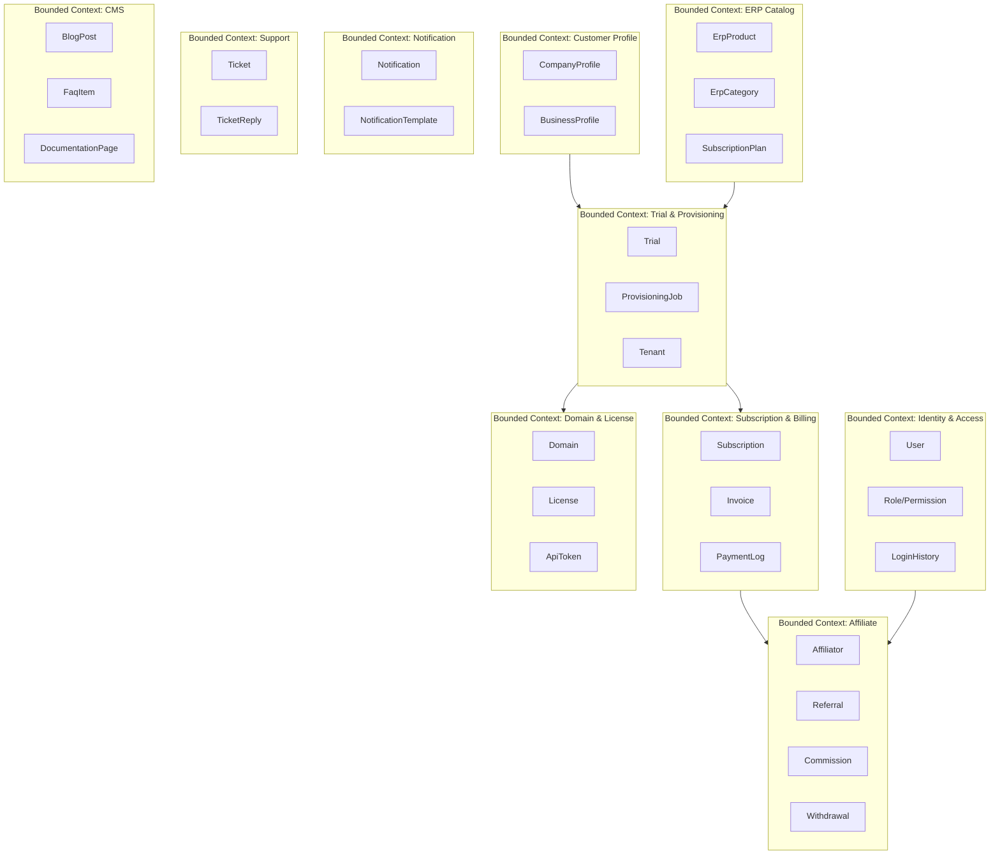
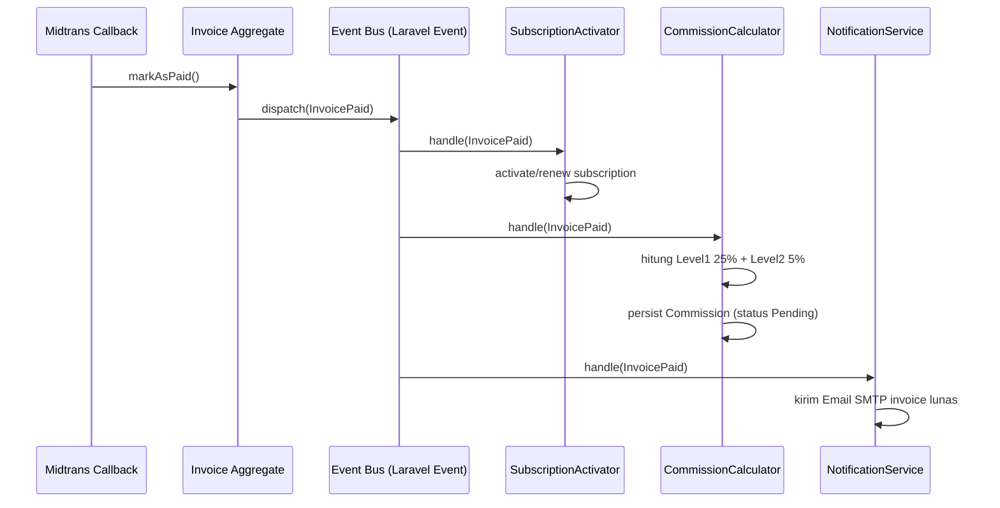

# COOCA.ID — Domain Driven Design (DDD)
## Bagian 4 dari Rangkaian Dokumentasi

---

# 1. Bounded Context



## 1.1 Context Map & Relationship

| Context A | Context B | Tipe Relasi | Penjelasan |
|---|---|---|---|
| Trial & Provisioning | ERP Catalog | Customer-Supplier | Trial bergantung pada definisi produk & plan dari Catalog |
| Subscription & Billing | Trial & Provisioning | Customer-Supplier | Subscription tercipta dari konversi Trial |
| Affiliate | Subscription & Billing | Conformist | Affiliate mendengarkan event pembayaran untuk hitung komisi, tidak mengubah data Billing |
| Notification | (Seluruh Context Lain) | Shared Kernel (Service) | Dipanggil sebagai service lintas context melalui event, bukan bagian dari domain model context lain |
| Domain & License | Trial & Provisioning | Customer-Supplier | Domain/License tercipta sebagai bagian output provisioning |

---

# 2. Aggregate

## 2.1 Aggregate: Trial
- **Aggregate Root:** `Trial`
- **Entities dalam Aggregate:** `TrialStatusHistory`
- **Invariant:** Status trial hanya dapat berubah mengikuti urutan state machine yang telah didefinisikan (lihat FSD Modul 4.7); tidak boleh melompat state (misal dari `Submitted` langsung ke `ActiveTrial`).

## 2.2 Aggregate: Subscription
- **Aggregate Root:** `Subscription`
- **Entities dalam Aggregate:** `SubscriptionStatusHistory`, `Invoice` (referensi, bukan children langsung — Invoice adalah aggregate terpisah yang berelasi via `subscription_id`)
- **Invariant:** Subscription tidak dapat berstatus `Active` tanpa minimal satu Invoice berstatus `Paid` yang terkait dengan siklus tersebut.

## 2.3 Aggregate: Commission
- **Aggregate Root:** `Commission`
- **Invariant:** Total komisi Level 1 + Level 2 untuk satu invoice tidak boleh melebihi 30% dari nominal invoice (25% + 5%), divalidasi pada level domain service sebelum persist.

## 2.4 Aggregate: ProvisioningJob
- **Aggregate Root:** `ProvisioningJob`
- **Entities dalam Aggregate:** `ProvisioningStep` (value object list, merepresentasikan setiap tahap dengan status masing-masing)
- **Invariant:** Job tidak dapat berstatus `Completed` jika ada satupun `ProvisioningStep` yang belum berstatus `Success`.

---

# 3. Entity

Entitas utama beserta identitasnya (seluruh identity menggunakan UUID v4):

| Entity | Identity | Deskripsi Singkat |
|---|---|---|
| User | `id (uuid)` | Identitas pengguna lintas guard (customer/affiliator/admin) |
| Trial | `id (uuid)` | Representasi satu pengajuan trial |
| Tenant | `id (uuid)` | Representasi satu instance ERP yang di-provisioning |
| Subscription | `id (uuid)` | Representasi satu langganan aktif/historis |
| Invoice | `id (uuid)` | Representasi satu tagihan |
| Commission | `id (uuid)` | Representasi satu catatan komisi dari satu transaksi |
| Domain | `id (uuid)` | Representasi satu domain (subdomain/custom) milik tenant |
| Ticket | `id (uuid)` | Representasi satu tiket dukungan |

---

# 4. Value Object

| Value Object | Komponen | Immutable | Digunakan Pada |
|---|---|---|---|
| Money | `amount (integer, dalam sen/rupiah bulat)`, `currency (default: IDR)` | Ya | Invoice, Commission, SubscriptionPlan |
| DomainName | `subdomain/custom string`, validasi RFC 1035 | Ya | Domain |
| LicenseSignature | `payload hash`, `signature`, `issued_at` | Ya | License |
| ProvisioningStep | `step_name`, `status`, `attempt_count`, `error_message` | Ya (di-replace, bukan di-mutate langsung) | ProvisioningJob |
| CommissionRate | `level (1/2)`, `percentage (25/5)` | Ya | Commission calculation policy |
| EmailAddress | `value string`, validasi format RFC 5322 | Ya | User, Notification |

> **Prinsip Desain:** Value Object tidak memiliki identitas sendiri dan selalu dibandingkan berdasarkan kesetaraan nilai (structural equality), bukan referensi. Setiap perubahan pada Value Object menghasilkan instance baru, bukan mutasi objek lama — ini memastikan riwayat status (misal `ProvisioningStep`) dapat diaudit dengan aman.

---

# 5. Domain Event

| Domain Event | Dipicu Oleh | Ditangkap Oleh (Listener) |
|---|---|---|
| `UserRegistered` | Modul Authentication | NotificationService (kirim email verifikasi) |
| `EmailVerified` | Modul Authentication | NotificationService (kirim welcome email) |
| `TrialSubmitted` | Modul Trial Management | NotificationService, AdminApprovalQueue |
| `TrialApproved` | Modul Trial Management (Admin action) | ProvisioningEngine (mulai provisioning) |
| `ProvisioningCompleted` | Provisioning Engine | NotificationService, TrialStatusUpdater (set ActiveTrial) |
| `ProvisioningFailed` | Provisioning Engine | NotificationService, RollbackHandler |
| `InvoicePaid` | Modul Invoice & Payment (callback Midtrans) | SubscriptionActivator, CommissionCalculator, NotificationService |
| `SubscriptionActivated` | Modul Subscription | NotificationService, LicenseActivator |
| `SubscriptionExpired` | Scheduler (Cron) | NotificationService, AccessRestrictionHandler |
| `CommissionCalculated` | CommissionCalculator (listener dari InvoicePaid) | NotificationService |
| `CommissionAvailable` | Scheduler (setelah 14 hari holding) | NotificationService |
| `WithdrawalRequested` | Modul Affiliate | AdminNotificationService |
| `WithdrawalCompleted` | Modul Affiliate (Admin action) | NotificationService |
| `DomainVerified` | Modul Domain & License | SSLProvisioner |
| `TicketCreated` | Modul Ticketing | NotificationService, AdminAssignmentQueue |

## 5.1 Contoh Alur Event (Event Storming — Invoice Paid)



---

# 6. Repository

Repository Interface didefinisikan di layer Domain, diimplementasikan di layer Infrastructure (Eloquent). Contoh kontrak:

```
interface TrialRepositoryInterface {
    findById(uuid): ?Trial
    findActiveByCustomerAndProduct(customerId, erpProductId): ?Trial
    save(Trial trial): void
    nextExpiring(limit): Collection
}

interface CommissionRepositoryInterface {
    findByAffiliator(affiliatorId, filters): Collection
    sumAvailableBalance(affiliatorId): Money
    save(Commission commission): void
}

interface ProvisioningJobRepositoryInterface {
    findPendingSteps(): Collection
    findById(uuid): ?ProvisioningJob
    save(ProvisioningJob job): void
}
```

Seluruh Repository mengembalikan Domain Entity/Aggregate, bukan Eloquent Model secara langsung, untuk menjaga isolasi domain dari detail infrastruktur (ORM).

---

# 7. Service (Domain Service)

| Domain Service | Tanggung Jawab |
|---|---|
| `TrialEligibilityService` | Memvalidasi apakah customer boleh mengajukan trial (cek kuota, profil lengkap) |
| `ProvisioningOrchestratorService` | Mengorkestrasi seluruh step provisioning secara berurutan dan idempotent |
| `CommissionCalculationService` | Menghitung nominal komisi Level 1/2 berdasarkan invoice dan struktur referral |
| `SubscriptionRenewalService` | Menentukan invoice perpanjangan dan menjaga status subscription sesuai jadwal |
| `LicenseSigningService` | Menghasilkan dan memvalidasi signature License Key |
| `NotificationDispatchService` | Menyediakan API terpadu untuk mengirim notifikasi lintas kanal (Email SMTP wajib, WhatsApp opsional) |

---

# 8. Factory

| Factory | Fungsi |
|---|---|
| `TrialFactory` | Membuat instance Trial baru dengan status awal `Draft`, menetapkan `expired_at` berdasarkan konfigurasi produk ERP |
| `TenantFactory` | Membuat instance Tenant baru dengan UUID, nama database sesuai konvensi (`cooca_tenant_{uuid_short}`) |
| `InvoiceFactory` | Membuat Invoice baru dengan perhitungan nominal (plan price + addon - discount), termasuk invoice perpanjangan otomatis |
| `CommissionFactory` | Membuat record Commission Level 1 dan Level 2 (jika ada upline) dari satu InvoicePaid event |

---

# 9. Specification (Pattern)

Digunakan untuk enkapsulasi business rule query yang kompleks dan dapat digunakan ulang:

| Specification | Kriteria |
|---|---|
| `EligibleForTrialSpecification` | Profil lengkap DAN belum pernah trial produk ini DAN akun berstatus Verified |
| `EligibleForAutoRenewalSpecification` | Subscription berstatus Active DAN `active_until` dalam 7 hari ke depan DAN tidak dalam status Cancelled |
| `CommissionEligibleSpecification` | Invoice berstatus Paid DAN referral relationship valid DAN bukan invoice hasil refund |
| `DomainReadyForSSLSpecification` | Domain berstatus Verified DAN CNAME sudah mengarah dengan benar (DNS lookup sukses) |

---

# 10. Ubiquitous Language

Kamus istilah yang digunakan konsisten oleh seluruh tim (Product, Business Analyst, Developer, QA) agar tidak terjadi ambiguitas makna:

| Istilah | Definisi Resmi |
|---|---|
| Tenant | Satu instance aplikasi ERP yang telah di-provisioning untuk satu Customer, terisolasi secara database |
| Trial | Periode uji coba gratis suatu ERP dengan batas waktu tertentu sebelum wajib berlangganan |
| Provisioning | Rangkaian proses otomatis pembuatan Tenant, mulai dari database hingga ERP siap diakses |
| Subscription | Status berlangganan aktif suatu Tenant terhadap satu Subscription Plan |
| Affiliator | Mitra yang mereferensikan Customer baru dan berhak atas Commission |
| Referral | Relasi permanen antara Customer dan Affiliator yang merekrutnya |
| Commission | Nominal insentif yang diterima Affiliator dari transaksi Customer referralnya |
| Recurring Commission | Commission yang dihitung ulang setiap siklus pembayaran Subscription selama tetap aktif |
| License Key | Kredensial kriptografis yang memvalidasi keabsahan penggunaan ERP oleh Tenant tertentu |
| Grace Period | Masa toleransi 3 hari setelah jatuh tempo sebelum Subscription berstatus Suspended |
| Holding Period | Masa tahan 14 hari sebelum Commission dapat dicairkan (mengantisipasi refund) |

---

*Lanjut ke Bagian 5: System Architecture Document pada file `05-architecture.md`.*
