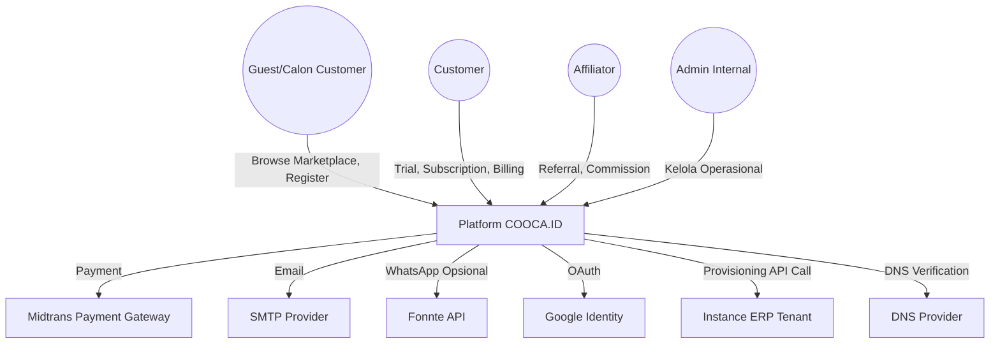
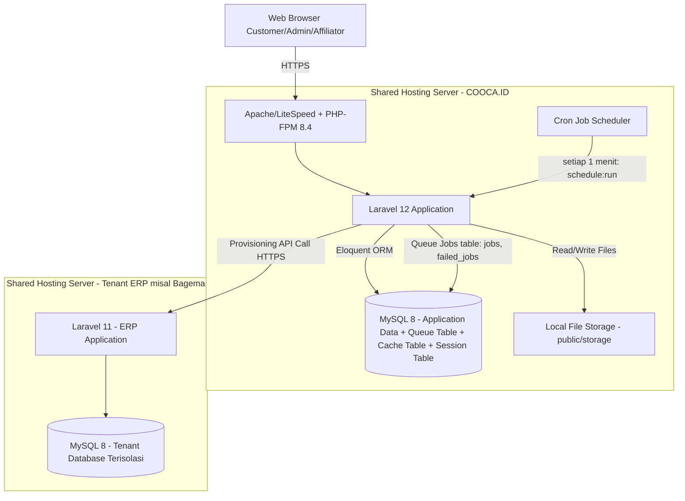
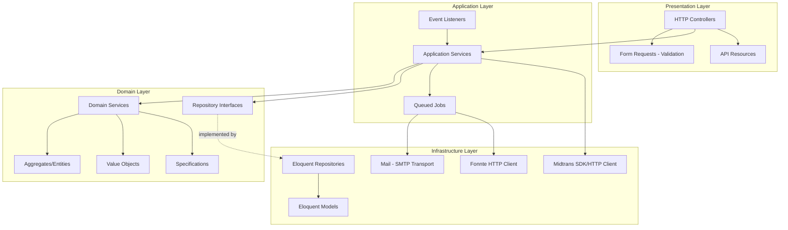
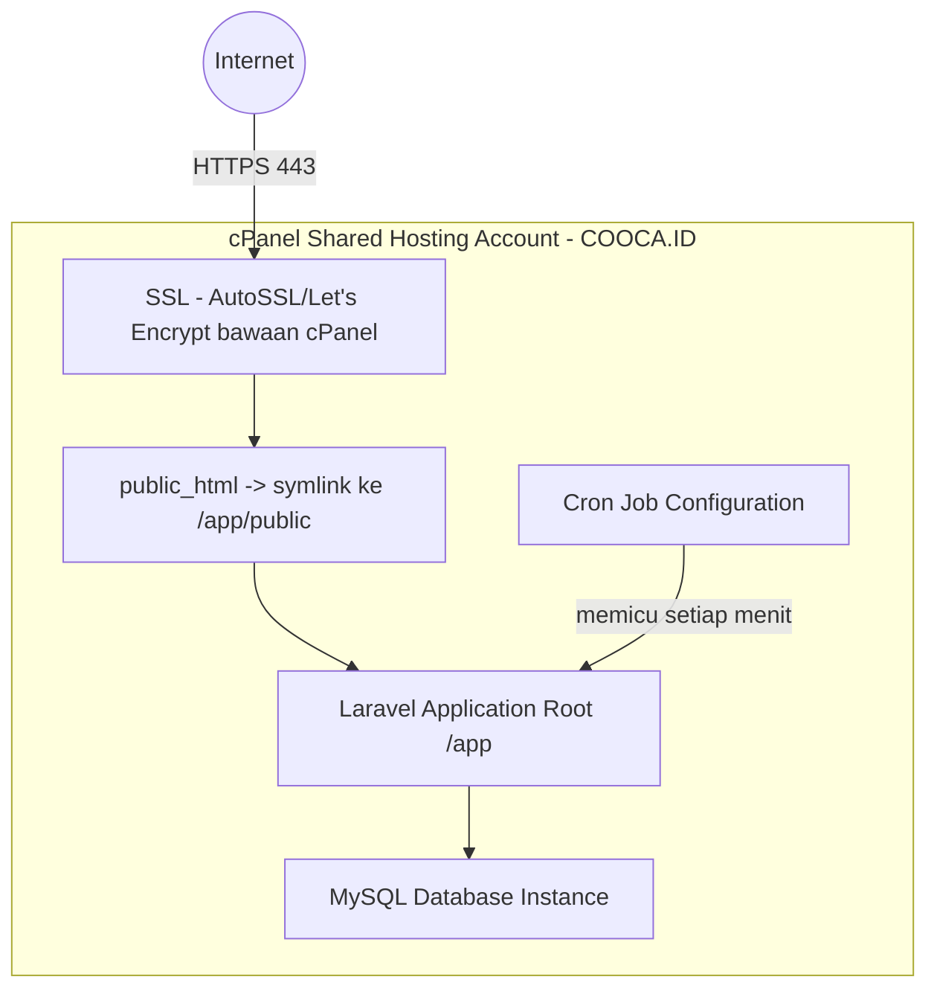
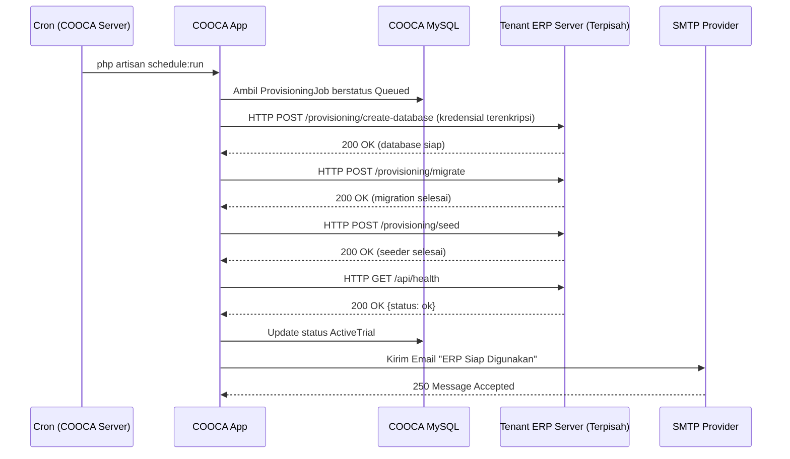
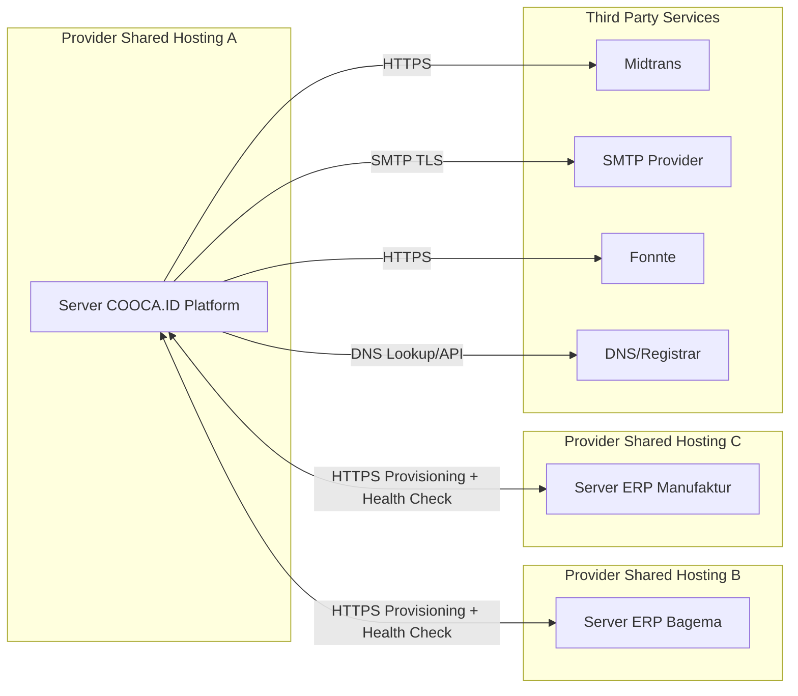

# COOCA.ID — System Architecture Document
## Bagian 5 dari Rangkaian Dokumentasi
### Adaptasi Infrastruktur: Shared Hosting (Tanpa Redis, Tanpa Nginx, Tanpa Supervisor)

---

# 1. Context Diagram

---

# 2. Container Diagram

**Keterangan Adaptasi:**
- Tidak ada container Redis — cache, session, dan queue seluruhnya menggunakan tabel MySQL (`cache`, `sessions`, `jobs`, `failed_jobs`).
- Tidak ada container Nginx sebagai reverse proxy terpisah — web server bawaan shared hosting (Apache/LiteSpeed) langsung melayani permintaan PHP-FPM.
- Tidak ada Supervisor untuk menjaga queue worker tetap hidup — proses queue dijalankan secara **batch per menit** oleh Cron Job yang memanggil `php artisan queue:work --stop-when-empty --max-time=50` (dibatasi 50 detik agar tidak tumpang tindih dengan eksekusi cron berikutnya).

---

# 3. Component Diagram (Application Layer — Laravel 12)

---

# 4. Deployment Diagram

**Catatan Deployment:**
- SSL menggunakan AutoSSL (Let's Encrypt) yang umum tersedia gratis di cPanel — tidak memerlukan konfigurasi Nginx/Certbot manual.
- Deployment kode dilakukan via Git deployment (cPanel Git Version Control) atau upload manual melalui SSH/SFTP jika tersedia, diikuti `composer install --no-dev --optimize-autoloader` dan `php artisan optimize`.

---

# 5. Sequence Diagram — Alur Provisioning Lintas Server (End-to-End)

---

# 6. Infrastructure Diagram (Topologi Keseluruhan)

**Prinsip Arsitektur Kunci — Independent Hosting per Produk ERP:** Setiap produk ERP (Bagema, Manufaktur, Retail, dst.) dihosting sepenuhnya independen (server/akun hosting terpisah), sesuai konteks bisnis existing COOCA yang berperan sebagai hub sentral. COOCA.ID hanya berkomunikasi dengan masing-masing instance ERP melalui REST API terstandar (endpoint provisioning dan health check) yang wajib diimplementasikan oleh setiap produk ERP mitra sesuai kontrak API pada Bagian 12 (API Specification).

---

*Lanjut ke Bagian 6: Database Design pada file `06-database.md`.*
