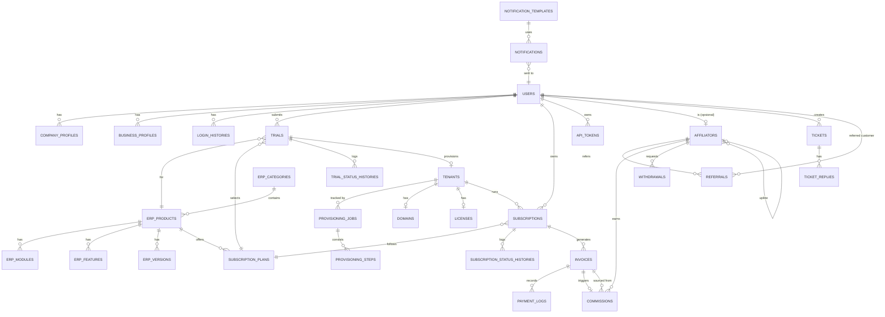

# COOCA.ID — Database Design
## Bagian 6 dari Rangkaian Dokumentasi

**Prinsip Umum:** Seluruh Primary Key menggunakan **UUID v4** (kolom `id CHAR(36)`). Seluruh tabel transaksional menerapkan **Soft Delete** (`deleted_at`). Seluruh tabel memiliki `created_at` dan `updated_at`. Karakter set: `utf8mb4_unicode_ci`. Engine: `InnoDB` (mendukung foreign key constraint dan transaksi ACID, krusial untuk konsistensi billing).

---

# 1. ERD Lengkap (Entity Relationship Diagram)

---

# 2. Logical Data Model (Ringkasan Entitas Utama)

| Entitas | Deskripsi | Relasi Utama |
|---|---|---|
| Users | Identitas seluruh aktor (customer, affiliator, admin) | 1:N ke hampir seluruh entitas transaksional |
| CompanyProfiles | Profil legal perusahaan customer | N:1 ke Users |
| ErpProducts | Katalog produk ERP | 1:N ke SubscriptionPlans, Trials |
| SubscriptionPlans | Paket harga per produk ERP | 1:N ke Trials, Subscriptions |
| Trials | Pengajuan uji coba | N:1 ke Users, ErpProducts; 1:1 ke Tenants |
| Tenants | Instance ERP hasil provisioning | 1:1 ke Domains, Licenses; 1:N ke Subscriptions |
| ProvisioningJobs | Tracking proses provisioning | 1:N ke ProvisioningSteps |
| Subscriptions | Status langganan tenant | N:1 ke Tenants, SubscriptionPlans; 1:N ke Invoices |
| Invoices | Tagihan | 1:N ke PaymentLogs; 1:1 ke Commissions (opsional) |
| Affiliators | Data mitra afiliasi | 1:N ke Referrals, Commissions, Withdrawals |
| Referrals | Relasi customer-affiliator | N:1 ke Users, Affiliators |
| Commissions | Catatan komisi | N:1 ke Affiliators, Invoices |
| Domains | Subdomain/custom domain tenant | 1:1 ke Tenants |
| Licenses | License key tenant | 1:1 ke Tenants |
| Tickets | Tiket dukungan | N:1 ke Users; 1:N ke TicketReplies |
| Notifications | Log notifikasi terkirim | N:1 ke Users, NotificationTemplates |

---

# 3. Physical Data Model & Data Dictionary

## 3.1 Tabel: `users`

| Kolom | Tipe | Constraint | Keterangan |
|---|---|---|---|
| id | CHAR(36) | PK | UUID v4 |
| user_type | ENUM('customer','affiliator','admin') | NOT NULL | Discriminator tipe user |
| name | VARCHAR(255) | NOT NULL | |
| email | VARCHAR(255) | UNIQUE, NOT NULL | |
| email_verified_at | TIMESTAMP | NULLABLE | |
| password | VARCHAR(255) | NULLABLE | Nullable karena login Google OAuth tidak memiliki password |
| google_id | VARCHAR(255) | NULLABLE, UNIQUE | |
| phone | VARCHAR(20) | NULLABLE, UNIQUE | |
| status | ENUM('unverified','verified','suspended','deactivated') | NOT NULL, DEFAULT 'unverified' | |
| affiliate_code_used | VARCHAR(50) | NULLABLE | Kode referral yang digunakan saat registrasi (immutable) |
| created_at, updated_at, deleted_at | TIMESTAMP | NULLABLE | |

**Index:** `idx_users_email`, `idx_users_status`, `idx_users_user_type`

## 3.2 Tabel: `company_profiles`

| Kolom | Tipe | Constraint |
|---|---|---|
| id | CHAR(36) | PK |
| user_id | CHAR(36) | FK -> users.id, UNIQUE |
| company_name | VARCHAR(255) | NOT NULL |
| business_type | VARCHAR(100) | NOT NULL |
| npwp | VARCHAR(20) | NULLABLE |
| address | TEXT | NOT NULL |
| city | VARCHAR(100) | NOT NULL |
| province | VARCHAR(100) | NOT NULL |
| postal_code | VARCHAR(10) | NULLABLE |
| created_at, updated_at, deleted_at | TIMESTAMP | |

## 3.3 Tabel: `erp_products`

| Kolom | Tipe | Constraint |
|---|---|---|
| id | CHAR(36) | PK |
| erp_category_id | CHAR(36) | FK -> erp_categories.id |
| name | VARCHAR(255) | NOT NULL |
| slug | VARCHAR(255) | UNIQUE, NOT NULL |
| description | TEXT | NULLABLE |
| provisioning_config | JSON | NOT NULL, berisi endpoint & resource requirement |
| status | ENUM('draft','published','unpublished','deprecated') | NOT NULL, DEFAULT 'draft' |
| trial_duration_days | INT | NOT NULL, DEFAULT 14 |
| auto_approval | BOOLEAN | NOT NULL, DEFAULT false |
| created_at, updated_at, deleted_at | TIMESTAMP | |

## 3.4 Tabel: `subscription_plans`

| Kolom | Tipe | Constraint |
|---|---|---|
| id | CHAR(36) | PK |
| erp_product_id | CHAR(36) | FK -> erp_products.id |
| name | VARCHAR(100) | NOT NULL |
| price | BIGINT UNSIGNED | NOT NULL, dalam satuan Rupiah bulat |
| billing_cycle | ENUM('monthly','yearly') | NOT NULL |
| max_users | INT | NULLABLE |
| features | JSON | NOT NULL |
| is_active | BOOLEAN | NOT NULL, DEFAULT true |
| created_at, updated_at, deleted_at | TIMESTAMP | |

## 3.5 Tabel: `trials`

| Kolom | Tipe | Constraint |
|---|---|---|
| id | CHAR(36) | PK |
| user_id | CHAR(36) | FK -> users.id |
| erp_product_id | CHAR(36) | FK -> erp_products.id |
| subscription_plan_id | CHAR(36) | FK -> subscription_plans.id |
| subdomain | VARCHAR(63) | UNIQUE, NOT NULL |
| affiliate_code | VARCHAR(50) | NULLABLE |
| status | ENUM('draft','submitted','waiting_approval','waiting_provisioning','provisioning','domain_setup','testing','active_trial','expired','rejected','converted_to_subscription') | NOT NULL, DEFAULT 'draft' |
| rejection_reason | TEXT | NULLABLE |
| started_at | TIMESTAMP | NULLABLE |
| expired_at | TIMESTAMP | NULLABLE |
| created_at, updated_at, deleted_at | TIMESTAMP | |

**Unique Constraint:** `(user_id, erp_product_id)` — mencegah trial ganda kecuali via approval khusus (BR-02), diimplementasikan sebagai partial unique index yang mengecualikan status `rejected`.

## 3.6 Tabel: `tenants`

| Kolom | Tipe | Constraint |
|---|---|---|
| id | CHAR(36) | PK |
| trial_id | CHAR(36) | FK -> trials.id, NULLABLE |
| erp_product_id | CHAR(36) | FK -> erp_products.id |
| database_name | VARCHAR(100) | UNIQUE, NOT NULL |
| database_host | VARCHAR(255) | NOT NULL |
| app_key_encrypted | TEXT | NOT NULL |
| status | ENUM('provisioning','active','suspended','archived') | NOT NULL |
| created_at, updated_at, deleted_at | TIMESTAMP | |

## 3.7 Tabel: `provisioning_jobs` & `provisioning_steps`

**provisioning_jobs**

| Kolom | Tipe | Constraint |
|---|---|---|
| id | CHAR(36) | PK |
| tenant_id | CHAR(36) | FK -> tenants.id |
| trigger_type | ENUM('trial_approved','subscription_paid','manual_retry') | NOT NULL |
| status | ENUM('queued','running','completed','failed','rolled_back') | NOT NULL |
| created_at, updated_at | TIMESTAMP | |

**provisioning_steps**

| Kolom | Tipe | Constraint |
|---|---|---|
| id | CHAR(36) | PK |
| provisioning_job_id | CHAR(36) | FK -> provisioning_jobs.id |
| step_name | ENUM('create_database','migration','seeder','generate_storage','generate_app_key','generate_license','generate_api_token','generate_subdomain','generate_ssl','health_check') | NOT NULL |
| status | ENUM('pending','running','success','failed') | NOT NULL |
| attempt_count | TINYINT UNSIGNED | NOT NULL, DEFAULT 0 |
| error_message | TEXT | NULLABLE |
| executed_at | TIMESTAMP | NULLABLE |

**Index:** `idx_provjob_status`, `idx_provstep_job_id_step_name` (composite, unique per job+step)

## 3.8 Tabel: `subscriptions`

| Kolom | Tipe | Constraint |
|---|---|---|
| id | CHAR(36) | PK |
| tenant_id | CHAR(36) | FK -> tenants.id |
| user_id | CHAR(36) | FK -> users.id |
| subscription_plan_id | CHAR(36) | FK -> subscription_plans.id |
| status | ENUM('pending','waiting_payment','paid','active','expired','suspended','cancelled','renewed') | NOT NULL |
| active_until | TIMESTAMP | NULLABLE |
| grace_period_until | TIMESTAMP | NULLABLE |
| created_at, updated_at, deleted_at | TIMESTAMP | |

## 3.9 Tabel: `invoices`

| Kolom | Tipe | Constraint |
|---|---|---|
| id | CHAR(36) | PK |
| subscription_id | CHAR(36) | FK -> subscriptions.id |
| invoice_number | VARCHAR(50) | UNIQUE, NOT NULL |
| midtrans_order_id | VARCHAR(100) | UNIQUE, NOT NULL |
| amount | BIGINT UNSIGNED | NOT NULL |
| discount_amount | BIGINT UNSIGNED | NOT NULL, DEFAULT 0 |
| status | ENUM('unpaid','paid','expired','cancelled','refunded') | NOT NULL |
| paid_at | TIMESTAMP | NULLABLE |
| due_at | TIMESTAMP | NOT NULL |
| created_at, updated_at, deleted_at | TIMESTAMP | |

## 3.10 Tabel: `payment_logs`

| Kolom | Tipe | Constraint |
|---|---|---|
| id | CHAR(36) | PK |
| invoice_id | CHAR(36) | FK -> invoices.id |
| midtrans_transaction_status | VARCHAR(50) | NOT NULL |
| raw_payload | JSON | NOT NULL |
| signature_valid | BOOLEAN | NOT NULL |
| is_duplicate | BOOLEAN | NOT NULL, DEFAULT false |
| received_at | TIMESTAMP | NOT NULL |

> `payment_logs` bersifat append-only (tidak ada UPDATE/DELETE pada level aplikasi) sebagai bukti audit finansial non-repudiation.

## 3.11 Tabel: `affiliators`

| Kolom | Tipe | Constraint |
|---|---|---|
| id | CHAR(36) | PK |
| user_id | CHAR(36) | FK -> users.id, UNIQUE |
| upline_affiliator_id | CHAR(36) | FK -> affiliators.id, NULLABLE (self-referencing) |
| referral_code | VARCHAR(50) | UNIQUE, NOT NULL |
| bank_account_verified | BOOLEAN | NOT NULL, DEFAULT false |
| status | ENUM('pending','active','suspended') | NOT NULL |
| created_at, updated_at, deleted_at | TIMESTAMP | |

## 3.12 Tabel: `referrals`

| Kolom | Tipe | Constraint |
|---|---|---|
| id | CHAR(36) | PK |
| affiliator_id | CHAR(36) | FK -> affiliators.id |
| referred_user_id | CHAR(36) | FK -> users.id, UNIQUE |
| created_at | TIMESTAMP | |

## 3.13 Tabel: `commissions`

| Kolom | Tipe | Constraint |
|---|---|---|
| id | CHAR(36) | PK |
| affiliator_id | CHAR(36) | FK -> affiliators.id |
| invoice_id | CHAR(36) | FK -> invoices.id |
| level | TINYINT UNSIGNED | NOT NULL, CHECK (level IN (1,2)) |
| percentage | DECIMAL(5,2) | NOT NULL |
| amount | BIGINT UNSIGNED | NOT NULL |
| status | ENUM('pending','available','requested','completed','rejected','voided') | NOT NULL |
| available_at | TIMESTAMP | NULLABLE |
| created_at, updated_at | TIMESTAMP | |

**Unique Constraint:** `(affiliator_id, invoice_id, level)` — mencegah duplikasi komisi dari callback ganda.

## 3.14 Tabel: `withdrawals`

| Kolom | Tipe | Constraint |
|---|---|---|
| id | CHAR(36) | PK |
| affiliator_id | CHAR(36) | FK -> affiliators.id |
| amount | BIGINT UNSIGNED | NOT NULL, CHECK (amount >= 100000) |
| bank_name | VARCHAR(100) | NOT NULL |
| bank_account_number | VARCHAR(50) | NOT NULL |
| status | ENUM('requested','completed','rejected') | NOT NULL |
| processed_at | TIMESTAMP | NULLABLE |
| created_at, updated_at | TIMESTAMP | |

## 3.15 Tabel: `domains`, `licenses`, `api_tokens`

**domains**

| Kolom | Tipe | Constraint |
|---|---|---|
| id | CHAR(36) | PK |
| tenant_id | CHAR(36) | FK -> tenants.id, UNIQUE |
| domain_name | VARCHAR(255) | UNIQUE, NOT NULL |
| type | ENUM('subdomain','custom') | NOT NULL |
| verification_token | VARCHAR(100) | NULLABLE |
| status | ENUM('pending_verification','verified','verification_expired','ssl_requested','active','inactive') | NOT NULL |
| verified_at | TIMESTAMP | NULLABLE |

**licenses**

| Kolom | Tipe | Constraint |
|---|---|---|
| id | CHAR(36) | PK |
| tenant_id | CHAR(36) | FK -> tenants.id, UNIQUE |
| license_key | VARCHAR(255) | UNIQUE, NOT NULL |
| signature | TEXT | NOT NULL |
| status | ENUM('active','revoked') | NOT NULL |
| issued_at | TIMESTAMP | NOT NULL |
| rotated_at | TIMESTAMP | NULLABLE |

**api_tokens**

| Kolom | Tipe | Constraint |
|---|---|---|
| id | CHAR(36) | PK |
| user_id | CHAR(36) | FK -> users.id |
| tenant_id | CHAR(36) | FK -> tenants.id, NULLABLE |
| token_hash | VARCHAR(255) | UNIQUE, NOT NULL |
| name | VARCHAR(100) | NOT NULL |
| expires_at | TIMESTAMP | NULLABLE |
| revoked_at | TIMESTAMP | NULLABLE |

## 3.16 Tabel: `notifications` & `notification_templates`

**notifications**

| Kolom | Tipe | Constraint |
|---|---|---|
| id | CHAR(36) | PK |
| user_id | CHAR(36) | FK -> users.id |
| notification_template_id | CHAR(36) | FK -> notification_templates.id |
| channel | ENUM('email','whatsapp') | NOT NULL |
| recipient | VARCHAR(255) | NOT NULL |
| payload | JSON | NOT NULL |
| status | ENUM('queued','sending','sent','retry_pending','failed') | NOT NULL |
| attempt_count | TINYINT UNSIGNED | NOT NULL, DEFAULT 0 |
| sent_at | TIMESTAMP | NULLABLE |
| error_message | TEXT | NULLABLE |

**notification_templates**

| Kolom | Tipe | Constraint |
|---|---|---|
| id | CHAR(36) | PK |
| event_code | VARCHAR(100) | UNIQUE, NOT NULL |
| channel | ENUM('email','whatsapp') | NOT NULL |
| subject | VARCHAR(255) | NULLABLE (khusus email) |
| body_template | TEXT | NOT NULL |
| is_active | BOOLEAN | NOT NULL, DEFAULT true |

## 3.17 Tabel Sistem Laravel (Wajib, Driver Database)

| Tabel | Fungsi |
|---|---|
| `jobs` | Antrian queue (queue driver = database) |
| `failed_jobs` | Job yang gagal setelah retry maksimal |
| `job_batches` | Tracking batch job (misal batch provisioning) |
| `cache` | Cache aplikasi (cache driver = database) |
| `cache_locks` | Lock mechanism untuk cache atomic operation |
| `sessions` | Session pengguna (session driver = database) |
| `personal_access_tokens` | Token Sanctum |
| `scheduler_heartbeats` | Custom table — mencatat setiap eksekusi cron untuk monitoring |

---

# 4. Relationship Summary

Seluruh relasi menggunakan **Foreign Key Constraint** dengan `ON DELETE RESTRICT` untuk entitas finansial (Invoice, Commission, PaymentLog — mencegah penghapusan tidak sengaja yang merusak jejak audit), dan `ON DELETE CASCADE` hanya untuk entitas anak murni seperti `TicketReply` terhadap `Ticket`, atau `ProvisioningStep` terhadap `ProvisioningJob`.

---

# 5. Index Strategy

| Tabel | Index | Tujuan |
|---|---|---|
| users | email, status, user_type | Login lookup, filtering admin |
| trials | (user_id, erp_product_id), status, expired_at | Cek kuota trial, scheduler expired |
| subscriptions | status, active_until | Scheduler perpanjangan/expired |
| invoices | midtrans_order_id, status, due_at | Callback lookup, scheduler expired invoice |
| commissions | (affiliator_id, status), invoice_id | Dashboard affiliator, traceability |
| notifications | status, channel | Monitoring & retry job |
| provisioning_steps | (provisioning_job_id, step_name) | Resume job dari step terakhir |

---

# 6. UUID Strategy

- Seluruh Primary Key menggunakan **UUID v4** yang digenerate di sisi aplikasi (bukan `UUID()` MySQL) menggunakan `Illuminate\Support\Str::uuid()`, memastikan konsistensi antara Domain Layer dan Database Layer sebelum entitas dipersist.
- UUID disimpan sebagai `CHAR(36)` (format standar dengan dash) demi keterbacaan pada log dan debugging, dengan trade-off ukuran index sedikit lebih besar dibanding `BINARY(16)` — dianggap dapat diterima mengingat skala data pada fase MVP–Fase 2.
- Nama database tenant menggunakan potongan 8 karakter pertama UUID (`uuid_short`) demi mematuhi batas panjang nama database MySQL pada shared hosting (umumnya dibatasi prefix akun cPanel + nama, total ≤ 64 karakter).

---

# 7. Soft Delete Strategy

- Kolom `deleted_at` diterapkan pada seluruh tabel yang merepresentasikan entitas bisnis inti (Users, Trials, Tenants, Subscriptions, Invoices, Commissions, Domains, Tickets).
- Query default Eloquent menggunakan Global Scope `SoftDeletes`, memastikan data yang "dihapus" tetap tersimpan untuk keperluan audit dan potensi restorasi.
- Penghapusan permanen (`forceDelete`) hanya dilakukan oleh scheduler arsip setelah periode retensi eksplisit terlampaui (misalnya Tenant trial expired > 30 hari, sesuai BR-TRIAL-05), dan didahului proses backup arsip ke storage terpisah.

---

# 8. Audit Strategy

- Tabel `audit_trails` generik digunakan lintas modul dengan struktur: `id (uuid)`, `actor_id`, `actor_type`, `auditable_type`, `auditable_id`, `action`, `old_values (JSON)`, `new_values (JSON)`, `ip_address`, `created_at`.
- Seluruh aksi Admin yang mengubah data finansial (adjustment invoice, override subscription, override komisi) WAJIB melalui service layer yang secara otomatis menulis ke `audit_trails` — tidak diperbolehkan melakukan update langsung ke Eloquent Model dari Controller tanpa melalui service ini.
- `payment_logs` dan `provisioning_steps` berperan sebagai audit trail khusus domain masing-masing (append-only, immutable).

---

*Lanjut ke Bagian 7: API Specification pada file `07-api-spec.md`.*
