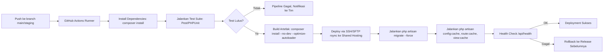

# COOCA.ID — DevOps Documentation
## Bagian 11 dari Rangkaian Dokumentasi
### Adaptasi Penuh untuk Shared Hosting (Tanpa Docker, Tanpa Redis, Tanpa Supervisor, Tanpa Nginx)

---

# 1. CI/CD Pipeline

Karena shared hosting tidak mendukung eksekusi container atau akses root, pipeline CI/CD berfokus pada **build-and-deploy via Git/SFTP** dengan tahap pengujian dilakukan di runner CI (GitHub Actions) sebelum artefak dikirim ke server.



**Catatan:** Jika penyedia shared hosting tidak menyediakan akses SSH, deployment dilakukan melalui fitur **Git Version Control cPanel** (pull dari repository) dikombinasikan dengan trigger deploy manual/webhook sederhana yang memanggil script `deploy.sh` melalui cron sekali jalan atau endpoint terproteksi khusus deployment.

---

# 2. Arsitektur Aplikasi (Bukan Docker)

Karena shared hosting tidak mendukung Docker, arsitektur deployment menggunakan struktur folder standar Laravel dengan pemisahan release untuk mendukung **zero-downtime deployment sederhana** (pola symlink ala Deployer/Envoyer):

```
/home/coocaid/
├── releases/
│   ├── 20260710120000/
│   ├── 20260711093000/  <- release terbaru
├── shared/
│   ├── .env
│   ├── storage/
├── current -> releases/20260711093000/   <- symlink aktif
public_html -> current/public/
```

Setiap deployment membuat folder release baru, menautkan `storage/` dan `.env` dari `shared/` (agar tidak hilang antar deployment), lalu memindahkan symlink `current` ke release terbaru setelah seluruh langkah build sukses — memastikan tidak ada downtime saat proses deploy berlangsung.

---

# 3. Queue Worker (Tanpa Supervisor)

Karena tidak ada Supervisor untuk menjaga proses `php artisan queue:work` tetap hidup selamanya, digunakan pendekatan **Cron-Triggered Batch Processing**:

**Cron Job Configuration (crontab -e / cPanel Cron Jobs):**
```
* * * * * cd /home/coocaid/current && php artisan schedule:run >> /dev/null 2>&1
```

**Scheduler Definition (`routes/console.php` atau `app/Console/Kernel.php`):**
```php
$schedule->command('queue:work --stop-when-empty --max-time=50 --tries=3')
    ->everyMinute()
    ->withoutOverlapping(2) // mencegah tumpang tindih jika eksekusi sebelumnya masih berjalan
    ->runInBackground();

$schedule->command('trials:expire-check')->daily();
$schedule->command('subscriptions:renewal-check')->daily();
$schedule->command('subscriptions:grace-period-check')->daily();
$schedule->command('commissions:release-holding-period')->hourly();
$schedule->command('domains:cleanup-expired-verification')->daily();
$schedule->command('scheduler:heartbeat')->everyMinute();
```

**Prinsip Desain Kunci:**
- Flag `--stop-when-empty` memastikan proses `queue:work` berhenti sendiri setelah antrian kosong, bukan berjalan selamanya (yang akan melanggar batas resource shared hosting).
- Flag `--max-time=50` membatasi eksekusi maksimal 50 detik agar tidak tumpang tindih dengan eksekusi cron menit berikutnya.
- `withoutOverlapping` mencegah dua instance scheduler berjalan bersamaan jika terjadi keterlambatan eksekusi cron oleh provider hosting.

---

# 4. Nginx → Digantikan Apache/LiteSpeed (Bawaan Hosting)

Tidak ada konfigurasi Nginx kustom. Web server bawaan shared hosting (Apache dengan `mod_php`/`mod_fcgid`, atau LiteSpeed pada hosting berbasis CloudLinux) melayani permintaan langsung. Konfigurasi yang diperlukan hanya pada level `.htaccess` (Apache) untuk:

```apache
<IfModule mod_rewrite.c>
    RewriteEngine On
    RewriteCond %{HTTPS} off
    RewriteRule ^ https://%{HTTP_HOST}%{REQUEST_URI} [L,R=301]

    RewriteCond %{REQUEST_FILENAME} !-d
    RewriteCond %{REQUEST_FILENAME} !-f
    RewriteRule ^ index.php [L]
</IfModule>

<IfModule mod_headers.c>
    Header set X-Content-Type-Options "nosniff"
    Header set X-Frame-Options "SAMEORIGIN"
    Header set Content-Security-Policy "default-src 'self'; script-src 'self' 'unsafe-inline' cdnjs.cloudflare.com"
</IfModule>
```

---

# 5. Redis → Digantikan Database Driver

| Fungsi | Driver Pengganti Redis | Konfigurasi `.env` |
|---|---|---|
| Cache | Database (tabel `cache`) | `CACHE_STORE=database` |
| Session | Database (tabel `sessions`) | `SESSION_DRIVER=database` |
| Queue | Database (tabel `jobs`, `failed_jobs`) | `QUEUE_CONNECTION=database` |
| Rate Limiter | Database (melalui cache driver) | otomatis mengikuti `CACHE_STORE` |

**Trade-off yang Disadari:** Performa I/O database driver lebih rendah dibanding Redis (in-memory), namun dapat diterima pada skala MVP–Fase 2 (ratusan hingga low-thousands tenant). Optimasi dilakukan melalui indexing yang ketat pada tabel `cache`, `sessions`, dan `jobs` (lihat Bagian 6 Database Design), serta pembersihan berkala (`php artisan cache:prune-stale-tags`, cleanup `sessions` expired via scheduler).

---

# 6. Backup Strategy

| Jenis Backup | Metode | Frekuensi | Retensi |
|---|---|---|---|
| Database Full Backup | `mysqldump` terjadwal via cron, disimpan terkompresi (`.sql.gz`) | Harian | 30 hari |
| Database Backup (cPanel Native) | Fitur bawaan cPanel Backup Wizard | Harian (redundansi kedua) | 14 hari (bergantung kuota hosting) |
| File Storage Backup | Arsip folder `storage/app` terjadwal | Harian | 30 hari |
| Backup Off-site | Upload hasil backup ke storage eksternal (misal cloud storage terpisah) via cron script menggunakan `curl`/API | Harian | 90 hari |

Script contoh cron backup off-site:
```bash
0 2 * * * /home/coocaid/scripts/backup-and-upload.sh >> /home/coocaid/logs/backup.log 2>&1
```

---

# 7. Disaster Recovery

| Skenario | Prosedur Pemulihan | RTO | RPO |
|---|---|---|---|
| Database korup/hilang | Restore dari `mysqldump` terakhir | ≤ 4 jam | ≤ 24 jam |
| Server hosting down (di luar kendali) | Restore ke akun hosting cadangan dari backup off-site | ≤ 8 jam | ≤ 24 jam |
| Deployment gagal (bug production) | Rollback symlink `current` ke folder `releases/` sebelumnya | ≤ 15 menit | 0 (tidak ada data hilang, hanya kode) |

---

# 8. Monitoring & Logging

Karena tidak ada akses tools monitoring tingkat sistem (seperti pada VPS/Cloud dengan Prometheus/Grafana), digunakan pendekatan **Application-Level Monitoring**:

- **Scheduler Heartbeat:** Setiap eksekusi cron menuliskan timestamp ke tabel `scheduler_heartbeats`; Admin Panel menampilkan peringatan bila heartbeat terakhir lebih dari 5 menit yang lalu (indikasi cron berhenti/gagal).
- **Application Log:** Laravel Log (`storage/logs/laravel.log`) dengan rotasi harian (`LOG_CHANNEL=daily`, retensi 14 hari) untuk mencegah membengkaknya storage shared hosting.
- **External Uptime Monitoring:** Layanan pihak ketiga (misal UptimeRobot atau sejenis) memantau endpoint `/api/health` setiap 5 menit dan mengirim notifikasi bila down.
- **Error Tracking:** Integrasi dengan layanan error tracking pihak ketiga (misal Sentry) untuk exception production, karena tidak ada dashboard server-level untuk memantau resource secara real-time.

---

# 9. Production Deployment Checklist (Ringkas — Detail Lengkap di Bagian 12)

- [ ] `.env` production terisi lengkap dan benar (APP_ENV=production, APP_DEBUG=false)
- [ ] `QUEUE_CONNECTION=database`, `CACHE_STORE=database`, `SESSION_DRIVER=database`
- [ ] Cron job terdaftar dan heartbeat terverifikasi berjalan
- [ ] SSL aktif (AutoSSL/Let's Encrypt) pada domain utama dan seluruh subdomain tenant
- [ ] Backup terjadwal terverifikasi berjalan dan dapat di-restore (uji restore minimal sekali sebelum go-live)
- [ ] Rate limiting dan security header aktif
- [ ] Health check endpoint merespons 200 OK
- [ ] Notifikasi Email SMTP teruji terkirim end-to-end (bukan hanya konfigurasi, tapi uji kirim nyata)

---

*Lanjut ke Bagian 12: Production Readiness Checklist pada file `12-golive-checklist.md`.*
